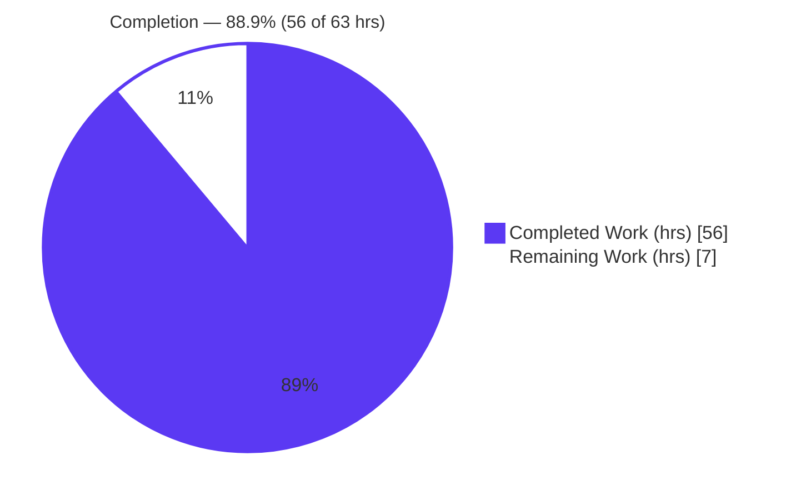
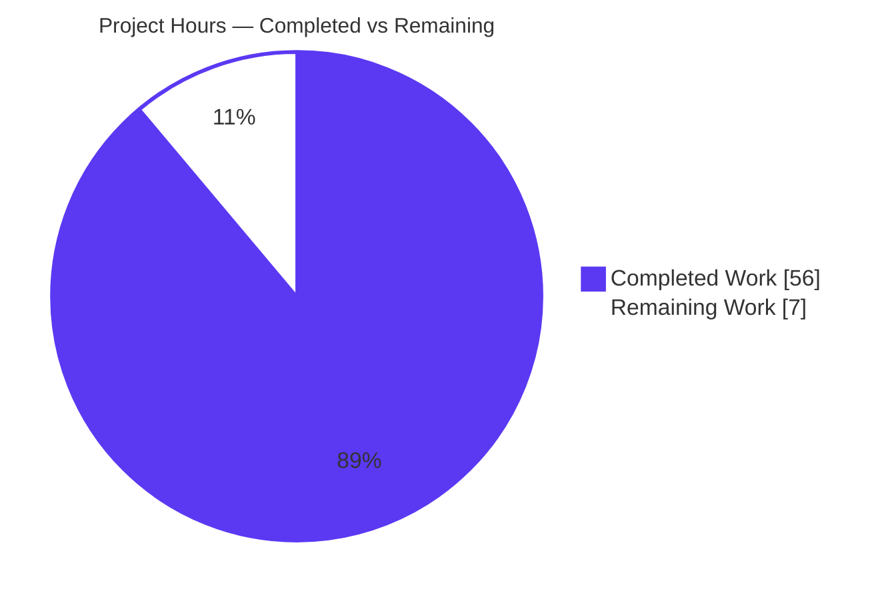
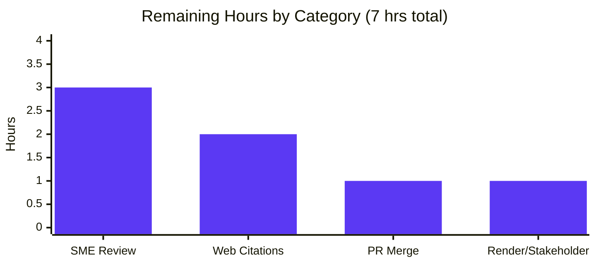
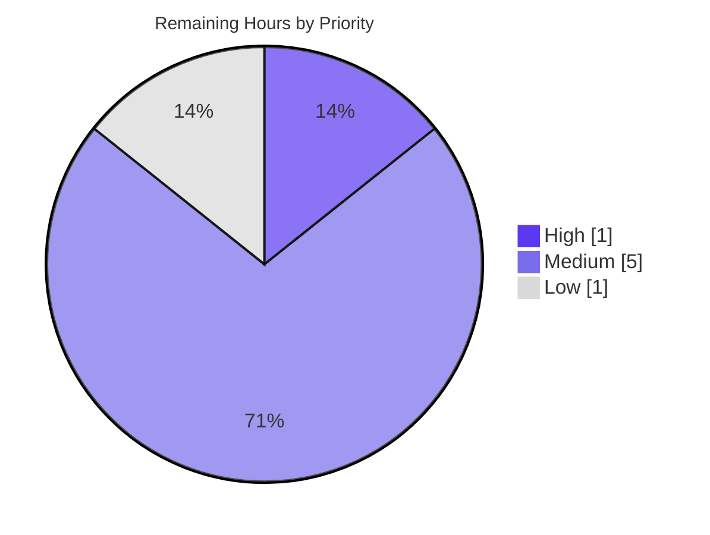

# Blitzy Project Guide
## CiviCRM FormBuilder (Afform) Documentation & React Migration Assessment

> **Document Color Legend** — Completed / AI Work: **Dark Blue `#5B39F3`** · Remaining / Not Completed: **White `#FFFFFF`** · Headings / Accents: **Violet-Black `#B23AF2`** · Highlight: **Mint `#A8FDD9`**

---

# 1. Executive Summary

## 1.1 Project Overview

This project delivers authoritative, **as-is** developer documentation for CiviCRM's FormBuilder (Afform) AngularJS form-rendering stack, plus a **quantified assessment** of migrating that user interface off end-of-life AngularJS 1.x to React. Target audiences are CiviCRM core developers, extension authors, and technical leadership planning UI modernization. Under a strict **minimal-change clause**, the work produces two module READMEs (core runtime + admin editor), a current-state-and-migration analysis document, behavior-preserving inline comments in nine AngularJS files, and a self-contained reveal.js executive presentation. No runtime behavior is altered. **Business impact:** it de-risks a future React migration by quantifying the AngularJS surface, mapping the shared-base blast radius, and sequencing the work lowest-risk-first.

## 1.2 Completion Status



| Metric | Hours |
|--------|-------|
| **Total Hours** | **63** |
| Completed Hours (AI + Manual) | 56 |
| Remaining Hours | 7 |
| **Percent Complete** | **88.9%** |

**Formula:** `Completion % = Completed ÷ (Completed + Remaining) × 100 = 56 ÷ 63 × 100 = 88.9%`

> Completion is calculated using AAP-scoped hours only (PA1 methodology). All 13 in-scope deliverable files are complete and validated; the remaining 7 hours are path-to-production activities (human review, optional citation polish, and merge). Capped below 99% per honest-assessment policy — documentation is not "in production" until human-reviewed and merged.

## 1.3 Key Accomplishments

- ✅ **Created** `ext/afform/core/README.md` (209 lines) — documents the `af`, `afCore`, and `afformStandalone` modules, the declarative `af-*` vocabulary (7 components / 11 directives), the `.aff.html` load→render→submit lifecycle, APIv4 data access, and `$scope` binding patterns.
- ✅ **Replaced** the civix `FIXME` stub in `ext/afform/admin/README.md` with full FormBuilder-editor documentation — the `afGuiEditor` host + 23 child components, the `afGui` service, the drag-and-drop flow, and `.aff.html` read/write.
- ✅ **Created** `docs/dev/formbuilder-current-state-and-react-migration.md` — quantified current-state metrics (independently verified **exact** against source) plus per-area React-migration complexity ratings and a phased roadmap.
- ✅ **Created** a self-contained reveal.js executive deck (16 slides) — Blitzy brand palette, pinned CDNs, 3 Mermaid diagrams, 26 Lucide icons, zero emoji; rendered in headless Chrome with zero console errors.
- ✅ **Added** behavior-preserving inline comments to **9** AngularJS files (38 insertions / 0 deletions) on non-obvious `$scope`/data-binding logic — all pass `node --check` and jshint.
- ✅ **Introduced** the repository's first **10 Mermaid diagrams** (7 in markdown + 3 in the deck), all parsing and rendering.
- ✅ **Maintained** strict scope discipline — zero out-of-scope files modified; `package.json`/`composer.json` untouched; no `vendor/`, `node_modules/`, or CMS-specific code touched.

## 1.4 Critical Unresolved Issues

**No critical, release-blocking issues were identified.** All 13 in-scope deliverables are complete, committed, and validated with zero errors. The items below are **non-blocking** path-to-production activities surfaced for transparency.

| Issue | Impact | Owner | ETA |
|-------|--------|-------|-----|
| SME technical accuracy/tone sign-off pending | Non-blocking — counts & citations already independently verified by autonomous validation; human confirmation recommended before merge | Afform/CiviCRM maintainer | 0.5 day |
| Live external web citations deferred | Non-blocking — migration assessment is fully grounded in repo + Technical Spec; external citations are optional polish (AAP §0.2.3) | Technical writer w/ web access | 0.5 day |

## 1.5 Access Issues

| System/Resource | Type of Access | Issue Description | Resolution Status | Owner |
|-----------------|----------------|-------------------|-------------------|-------|
| Live web / internet search (build env) | Outbound web access for research | Live web search returned no results in the build environment, so the migration assessment was grounded in direct repo analysis + Technical Spec §3.2.2 rather than externally-cited sources | **Open** — downstream author with web access to add the official AngularJS EOL announcement + an incremental-migration reference | Technical writer |
| `blitzy-deck/references/blitzy-reveal-theme.css` | Repository file reference | The canonical Blitzy reveal.js theme file referenced by the Executive Presentation rule is **not present** in this repository | **Resolved** — required `:root` brand properties embedded **inline** in the self-contained deck (21 brand CSS vars), preserving the no-local-dependency requirement | Blitzy agent (done) |
| CDN reachability (deck runtime) | Outbound HTTPS to jsDelivr/unpkg/Google Fonts | The deck loads reveal.js / mermaid / lucide / fonts from pinned CDNs at view time | **By design** (rule-mandated self-contained file) — requires internet to render; documented in Section 9 | Viewer environment |

## 1.6 Recommended Next Steps

1. **[High]** Obtain Afform/AngularJS **SME accuracy sign-off** on the documented counts, cited line numbers, and migration complexity ratings (HT-2, 3h).
2. **[Medium]** Add **live external web citations** to the migration document — the official AngularJS end-of-life announcement and a reputable incremental ("strangler-fig") migration reference (HT-3, 2h).
3. **[High]** Complete **PR review, approval & merge** to `master` (HT-1, 1h) — no code blockers to resolve first.
4. **[Low]** Perform **GitHub-native Mermaid render verification** and circulate the executive deck to non-technical leadership (HT-4, 1h).

---

# 2. Project Hours Breakdown

## 2.1 Completed Work Detail

| Component | Hours | Description |
|-----------|-------|-------------|
| Form Core runtime README (`ext/afform/core/README.md`) | 9 | New 209-line module README: `af`/`afCore`/`afformStandalone`, `af-*` vocabulary (7 comp / 11 dir), `.aff.html` load→render flow (Mermaid), APIv4 access, `$scope` patterns, dependencies, limitations; 41 source citations |
| FormBuilder editor README (`ext/afform/admin/README.md`) | 8 | Replaced civix `FIXME` stub (175 lines, +155/-24): `afGuiEditor` + 23 components, `afGui` service, drag-and-drop flow (Mermaid), `.aff.html` read/write, dependency chain; 55 source citations |
| Current-state & React migration analysis | 11 | New 176-line doc: quantified AngularJS surface table (verified exact), declarative-markup analysis, APIv4 boundary, per-area complexity ratings, lowest-risk slice, hardest components, phased roadmap; 3 Mermaid diagrams; 28 citations |
| Executive reveal.js presentation deck | 11 | New 853-line self-contained deck: 16 slides, Blitzy brand theme inline, pinned CDNs, 3 Mermaid + 26 Lucide icons, 5 narrative beats, zero emoji; full rule conformance |
| Behavior-preserving inline comments (9 JS files) | 6 | 38 insertions / 0 deletions across core `af`/`afCore` + admin `afGuiEditor` files; explain `$scope` model wiring, APIv4 binding, repeat transclusion, `afGui` `$parse` eval, `ui-sortable` drag model |
| Source-code analysis & quantitative measurement | 5 | Measured components/directives/controllers/services/filters/`$scope`/templates/`.aff.html`/`crmApi4` counts across core, admin, SearchKit, and the shared `crmUi` base |
| Autonomous validation & QA | 6 | Mermaid parse/render, `node --check`, jshint, live deck render in headless Chrome, count cross-checks at base commit, cross-document link resolution |
| **Total Completed** | **56** | |

## 2.2 Remaining Work Detail

| Category | Hours | Priority |
|----------|-------|----------|
| SME technical accuracy & tone review of all docs + inline comments | 3 | Medium |
| Add live external web citations (AngularJS EOL announcement + incremental-migration reference) | 2 | Medium |
| PR review, approval & merge to `master` | 1 | High |
| GitHub-native Mermaid render verification + executive-deck stakeholder review | 1 | Low |
| **Total Remaining** | **7** | |

## 2.3 Hours Calculation & Methodology

| Quantity | Value |
|----------|-------|
| Completed Hours (Section 2.1 total) | 56 |
| Remaining Hours (Section 2.2 total) | 7 |
| **Total Project Hours** | **63** |
| Completion Percentage | 56 ÷ 63 × 100 = **88.9%** |

**Scope basis (PA1):** Hours cover only AAP-defined deliverables plus standard path-to-production activities for a documentation effort. Every completed-hour line traces to a specific AAP deliverable; every remaining-hour line traces to a path-to-production need or the single AAP-flagged optional enhancement (live web citations, §0.2.3). No items outside AAP scope are included. **Confidence: High** — all deliverables are objectively present, committed, and independently validated; the remaining estimate is bounded human review/merge work.

---

# 3. Test Results

> **Integrity note:** This is a documentation-only effort under a minimal-change clause. **No JavaScript unit tests apply** to comment-only/markdown changes — the `afform` extension ships only PHP tests (no JS specs), and `karma.conf.js` excludes `ext/afform` and requires a full CiviCRM stack via `civicrm-cv` (explicitly out of scope per AAP §0.9.2). The table below reports the **applicable autonomous validations** actually executed by Blitzy's validation systems for this project. All entries originate from Blitzy's autonomous validation logs.

| Test Category | Framework | Total | Passed | Failed | Coverage % | Notes |
|---------------|-----------|-------|--------|--------|-----------|-------|
| JS syntax (behavior-preservation) | `node --check` | 9 | 9 | 0 | 100% | All 9 inline-comment files; additions only, 0 deletions |
| JS lint | jshint (repo `.jshintrc`) | 9 | 9 | 0 | 100% | Zero violations |
| Mermaid diagram parse | mermaid@11.4.0 | 10 | 10 | 0 | 100% | 7 markdown + 3 deck diagrams |
| Mermaid render (markdown → SVG) | mermaid@11.4.0 | 7 | 7 | 0 | 100% | Core README 2, admin README 2, migration doc 3 |
| Deck runtime render | Chrome 149 (headless, 1920×1080) | 16 | 16 | 0 | 100% | 16 slides, 0 console errors; 3 Mermaid → SVG; 26 Lucide icons; `Reveal.getTotalSlides()=16` |
| Cross-document link resolution | path resolution | 25 | 25 | 0 | 100% | All relative links resolve |
| Content count cross-checks | grep methodology @ base `fb4db3a66c` | 30+ | 30+ | 0 | 100% | Documented counts match source exactly |
| **Overall** | — | **—** | **All Pass** | **0** | **100%** | All applicable validations pass |

---

# 4. Runtime Validation & UI Verification

**Legend:** ✅ Operational · ⚠ Partial · ❌ Failing

**Documentation rendering**
- ✅ Markdown renders natively on the Git host, including fenced ```mermaid blocks (GitHub-native rendering).
- ✅ All 7 markdown Mermaid diagrams parse and render to SVG (validator-confirmed).
- ✅ 25/25 cross-document relative links resolve (READMEs ↔ migration doc ↔ `ext/afform/docs`).

**Executive presentation (reveal.js deck)**
- ✅ Loads in Google Chrome 149 (headless, 1920×1080) with **zero console errors/warnings** — re-checked after slide navigation (which fires `mermaid.run()` + `lucide.createIcons()`).
- ✅ `Reveal.getTotalSlides() = 16` — within the 12–18 slide rule constraint.
- ✅ All 3 deck Mermaid diagrams render to SVG (`data-processed="true"`).
- ✅ All 26 Lucide icons render (0 leftover `<i data-lucide>` placeholders).
- ✅ Visual spot-checks captured for slide 1 (title/hero gradient), slide 2 (KPI grid), slide 3 (architecture Mermaid), the complexity table, and the navy closing slide — all brand- and rule-conformant.

**Source behavior (inline-comment files)**
- ✅ All 9 modified AngularJS files pass `node --check` (syntactically valid).
- ✅ Diffs are `//`-comment additions only (0 deletions) → **behavior-preserving** by construction.

**API integration outcomes**
- ⚠ Not applicable — documentation-only effort; no APIs were added, called at runtime, or modified. The documented `Afform` APIv4 surface (`Get` / `Prefill` / `Process` / `Submit` / `Save`) was verified to exist as cited, but no runtime API execution was required or performed.

---

# 5. Compliance & Quality Review

This matrix cross-maps AAP deliverables and rules to their delivered status.

| AAP Requirement / Rule | Benchmark | Status | Progress |
|------------------------|-----------|--------|----------|
| Deliverable 1a — Core module README (CREATE) | Purpose, modules, `af-*` vocabulary, load/render flow, APIv4, `$scope` | ✅ Pass | 100% |
| Deliverable 1b — Admin editor README (UPDATE, replace stub) | `afGuiEditor` map, `afGui` service, drag-and-drop, `.aff.html` r/w | ✅ Pass | 100% |
| Deliverable 2a — Current-state quantification | Counts table verified exact against source | ✅ Pass | 100% |
| Deliverable 2b — React migration complexity | Rating per area, lowest-risk slice, hardest components, phased roadmap | ✅ Pass | 100% |
| Deliverable 3 — Inline comments (9 files) | Behavior-preserving, CiviCRM `//` style, non-obvious logic only | ✅ Pass | 100% |
| Rule §0.10 — Executive Presentation | 12–18 slides, brand palette, pinned CDNs, zero emoji, inline `:root` | ✅ Pass (22/22 checks) | 100% |
| ≥5 Mermaid diagrams (D1–D5) | Architecture, data flow, drag-and-drop, blast radius, roadmap | ✅ Pass (10 delivered) | 100% |
| Source-code citations throughout | Path (+ line where natural) per claim | ✅ Pass (124 citations) | 100% |
| Cross-document navigation links | Bidirectional README ↔ migration doc | ✅ Pass (25/25 resolve) | 100% |
| Style conformance | Parent README tone; CiviCRM JS comment style | ✅ Pass | 100% |
| Minimal-change clause | No behavior/interface change; manifests untouched | ✅ Pass (0 deletions in JS; 0 out-of-scope) | 100% |
| Scope boundaries | Skip `vendor/`/`node_modules/`/CMS code; Standalone | ✅ Pass | 100% |
| Web-search grounding (§0.2.3) | Research migration patterns | ⚠ Substantively met; live external citations deferred | 90% |

**Fixes applied during autonomous validation:** Earlier checkpoints resolved review findings (CP1 README findings, an ASCII-hyphen normalization in two inline comments, a `crmUi` reach-count correction, refreshed `afGuiEditor` citations, and CP4 QA findings on component coverage / metric accuracy / deck KPI traceability). At final validation, **no further fixes were required** — every deliverable passed on inspection, so no new commits were needed.

**Outstanding (non-blocking):** SME accuracy sign-off and optional live external web citations (see Section 2.2).

---

# 6. Risk Assessment

| Risk | Category | Severity | Probability | Mitigation | Status |
|------|----------|----------|-------------|------------|--------|
| AngularJS 1.8.2 is end-of-life (no upstream security/compat fixes) | Technical | Medium | High | Accurately characterized as the **documented subject** and migration driver; full migration assessment delivered. **Not introduced** by this work | Documented (subject of assessment) |
| Documentation drift — cited line numbers/counts may go stale as code evolves | Technical | Low | Medium | Reproducible grep-based count methodology; relative links; framework-agnostic diagrams | Mitigated |
| Deck depends on pinned CDN scripts (reveal.js / mermaid / lucide) | Security | Low | Low | Versions pinned per Executive Presentation rule; optional SRI hashes for defense-in-depth | By design (rule-mandated) |
| Markdown Mermaid relies on GitHub-native rendering | Operational | Low | Low | GitHub renders ```mermaid natively; independently render-verified | Mitigated |
| Deck requires internet to load CDN libs (no offline render) | Operational | Low | Low | Self-contained single file by design; documented in Section 9 | By design (rule-mandated) |
| Live external web citations deferred to downstream author | Integration | Low | Medium | Assessment grounded in repo + Technical Spec §3.2.2; honesty note discloses; tracked as remaining (HT-3) | Open (remaining) |
| SME accuracy review of technical claims pending pre-merge | Integration | Low | Low | Counts independently verified (validator + this assessment); 124 dense citations | Open (remaining) |

**Overall risk profile: LOW.** No compilation/test failure risk (9/9 `node --check` pass, 0 deletions). No security surface changed (no auth/data/code paths touched; no manifest changes). No dependency vulnerabilities introduced.

---

# 7. Visual Project Status

### Project Hours Breakdown



> **Completed Work = 56 hrs (Dark Blue `#5B39F3`)** · **Remaining Work = 7 hrs (White `#FFFFFF`)** · Total = 63 hrs · **88.9% complete**. The "Remaining Work" value (7) equals Section 1.2 Remaining Hours and the Section 2.2 Hours total.

### Remaining Hours by Category



### Priority Distribution of Remaining Work



---

# 8. Summary & Recommendations

**Achievements.** The project delivers all four AAP deliverable categories in full: two module READMEs (the core runtime README created, the admin editor README rewritten from a civix stub), a current-state-and-React-migration analysis with a verified quantitative backbone, behavior-preserving inline comments across nine AngularJS files, and a rule-conformant self-contained reveal.js executive deck. It introduces the repository's first 10 Mermaid diagrams and 124 source-code citations, all under a strict minimal-change clause with zero out-of-scope modifications.

**Remaining gaps.** The project is **88.9% complete (56 of 63 hours)**. The remaining 7 hours are entirely path-to-production: human SME accuracy sign-off (3h), optional live external web citations (2h), PR review & merge (1h), and GitHub render verification + stakeholder review (1h). **There are no code, compilation, or test blockers.**

**Critical path to production.** SME accuracy sign-off → add optional external citations → PR review & merge → render verification and stakeholder distribution. None of these steps depend on resolving defects; they are standard documentation-review and publication activities.

**Success metrics.**

| Metric | Result |
|--------|--------|
| AAP requirement groups completed | 12 / 12 |
| In-scope files delivered & committed | 13 / 13 |
| Autonomous validation gates passed | 5 / 5 |
| Mermaid diagrams delivered (target ≥5) | 10 |
| JS files behavior-preserving (`node --check` + jshint) | 9 / 9 |
| Out-of-scope files modified | 0 |
| Executive deck rule checks | 22 / 22 |

**Production readiness assessment.** The deliverables are **content-complete and validation-clean**. With no blocking issues, the work is ready for human review and merge. Following SME sign-off and merge, the documentation will be immediately consumable on the Git host, and the executive deck is presentation-ready for leadership.

---

# 9. Development Guide

> The deliverables require **no build pipeline** and **no dependency installation**. Markdown renders on the Git host; the executive deck is a single self-contained HTML file. The commands below were executed and verified in the analysis environment (Node v20.20.2, npm 11.1.0, Python 3.13.7, Git 2.51.0).

## 9.1 System Prerequisites

- **Git** — to clone the repository and check out the branch.
- **A Markdown viewer that renders Mermaid** — the GitHub web UI (recommended), or VS Code with the *Markdown Preview Mermaid Support* extension.
- **A modern browser** — Chrome, Firefox, or Edge (to open the executive deck).
- **Internet access** — required only to render the deck (loads reveal.js / mermaid / lucide / Google Fonts from pinned CDNs).
- **Optional:** Node.js 20+ (portable JS syntax check), Python 3 (local static file server).
- **Not required:** PHP, Composer, MySQL, or a CiviCRM runtime (AAP §0.9.2).

## 9.2 Environment Setup

```bash
# Clone and check out the documentation branch
git clone <repository-url> civicrm-core
cd civicrm-core
git checkout blitzy-92dc732d-a705-4187-be0b-14207f3535b8
```

No virtual environment, package install, or build step is needed — the repository has no documentation generator.

## 9.3 Previewing the Documentation

**Markdown (READMEs + migration doc):** open on the Git host (GitHub renders ```mermaid blocks natively), or preview locally in a Mermaid-enabled Markdown viewer. Files:

```bash
# In-repo locations
ext/afform/core/README.md
ext/afform/admin/README.md
docs/dev/formbuilder-current-state-and-react-migration.md
```

**Executive deck (HTML):** open directly in a browser, or serve over HTTP:

```bash
cd docs/dev
python3 -m http.server 8000
# Then visit:
#   http://localhost:8000/formbuilder-react-migration-executive-summary.html
# Verified: HTTP 200, ~35 KB served.
```

## 9.4 Verification Steps

```bash
# 1) Behavior-preservation: syntax-check each inline-comment file (expect zero output = OK)
for f in \
  ext/afform/core/ang/af/afForm.component.js \
  ext/afform/core/ang/af/afField.component.js \
  ext/afform/core/ang/af/afFieldset.directive.js \
  ext/afform/core/ang/af/afRepeat.directive.js \
  ext/afform/core/ang/afCore/Api4Action.js \
  ext/afform/admin/ang/afGuiEditor.js \
  ext/afform/admin/ang/afGuiEditor/afGuiEditor.component.js \
  ext/afform/admin/ang/afGuiEditor/afGuiElements.component.js \
  ext/afform/admin/ang/afGuiEditor/afGuiEntity.component.js; do
  node --check "$f" && echo "OK: $f"
done

# 2) Count Mermaid blocks in the markdown deliverables (expect 2, 2, 3)
grep -rc '```mermaid' \
  ext/afform/core/README.md \
  ext/afform/admin/README.md \
  docs/dev/formbuilder-current-state-and-react-migration.md

# 3) Reproduce a documented count (expect 7 core components)
grep -rIh '\.component(' ext/afform/core/ang --include='*.js' | wc -l

# 4) Verify the deck slide count (expect 16) and that diagrams/icons are present
grep -c '<section' docs/dev/formbuilder-react-migration-executive-summary.html
grep -c '<pre class="mermaid">' docs/dev/formbuilder-react-migration-executive-summary.html   # 3 (4th match is a JS comment string)
grep -oE 'data-lucide="[^"]*"' docs/dev/formbuilder-react-migration-executive-summary.html | wc -l   # 26
```

## 9.5 Example Usage

```bash
# Serve and open the deck, then navigate slides with arrow keys.
# On 'ready' and each 'slidechanged', the deck calls mermaid.run() and lucide.createIcons().
cd docs/dev && python3 -m http.server 8000
# Expected: 16 slides, all Mermaid rendered to SVG, all Lucide icons visible, zero console errors.
```

## 9.6 Troubleshooting

- **Mermaid blocks display as raw code** → the viewer lacks Mermaid support. Use the GitHub web UI or a Mermaid-enabled Markdown previewer.
- **Deck is blank / diagrams or icons missing** → no internet access to the pinned CDNs. Ensure outbound HTTPS to jsDelivr/unpkg/Google Fonts is reachable (the deck is intentionally CDN-driven per the Executive Presentation rule).
- **`Address already in use` on the local server** → choose another port, e.g. `python3 -m http.server 8099`.
- **`jshint: command not found`** → jshint is not required to consume the docs. Use the portable `node --check <file>` for a no-install syntax check (the validator used a jshint copy under `/tmp/blitzy-tools`, outside the repo).
- **Lucide icons absent** → check the browser console; the same CDN/network cause usually applies.

---

# 10. Appendices

## A. Command Reference

| Purpose | Command |
|---------|---------|
| Check out the branch | `git checkout blitzy-92dc732d-a705-4187-be0b-14207f3535b8` |
| List in-scope changes vs master | `git diff --stat origin/master...blitzy-92dc732d-a705-4187-be0b-14207f3535b8` |
| Syntax-check a JS file (behavior-preservation) | `node --check <file.js>` |
| Count Mermaid blocks in a markdown file | `grep -c '```mermaid' <file.md>` |
| Reproduce a documented count | `grep -rIh '\.component(' ext/afform/core/ang --include='*.js' \| wc -l` |
| Serve the deck locally | `cd docs/dev && python3 -m http.server 8000` |
| Count deck slides | `grep -c '<section' docs/dev/formbuilder-react-migration-executive-summary.html` |

## B. Port Reference

| Port | Service | Notes |
|------|---------|-------|
| 8000 | Python `http.server` (deck preview) | Local-only; any free port works (e.g., 8099). Not required if opening the HTML file directly. |

## C. Key File Locations

| File | Mode | Lines |
|------|------|-------|
| `ext/afform/core/README.md` | CREATE | 209 |
| `ext/afform/admin/README.md` | UPDATE | 175 (+155/-24) |
| `docs/dev/formbuilder-current-state-and-react-migration.md` | CREATE | 176 |
| `docs/dev/formbuilder-react-migration-executive-summary.html` | CREATE | 853 |
| `ext/afform/core/ang/af/afForm.component.js` | UPDATE (comments) | +6 |
| `ext/afform/core/ang/af/afField.component.js` | UPDATE (comments) | +4 |
| `ext/afform/core/ang/af/afFieldset.directive.js` | UPDATE (comments) | +4 |
| `ext/afform/core/ang/af/afRepeat.directive.js` | UPDATE (comments) | +4 |
| `ext/afform/core/ang/afCore/Api4Action.js` | UPDATE (comments) | +4 |
| `ext/afform/admin/ang/afGuiEditor.js` | UPDATE (comments) | +10 |
| `ext/afform/admin/ang/afGuiEditor/afGuiEditor.component.js` | UPDATE (comments) | +3 |
| `ext/afform/admin/ang/afGuiEditor/afGuiElements.component.js` | UPDATE (comments) | +2 |
| `ext/afform/admin/ang/afGuiEditor/afGuiEntity.component.js` | UPDATE (comments) | +1 |

**Reference (read-only) inputs:** `ext/afform/README.md`, `ext/afform/docs/*.md`, `ang/crmUi.js`.

## D. Technology Versions

| Technology | Version | Role |
|------------|---------|------|
| CiviCRM core | 6.17.alpha1 | Product version at analyzed commit (`xml/version.xml`) |
| AngularJS | 1.8.2 | Documented framework (EOL since Jan 2022) — migration driver |
| angular-ui-sortable | 0.19.0 | Editor drag-and-drop (documented) |
| Monaco editor | 0.49.0 | Afform code editor (documented) |
| reveal.js | 5.1.0 (CDN, pinned) | Executive deck slide framework |
| Mermaid | 11.4.0 (CDN, pinned) | Diagram rendering (markdown + deck) |
| Lucide | 0.460.0 (CDN, pinned) | Deck SVG icons |
| Node.js / npm | 20.20.2 / 11.1.0 | Verification tooling (`node --check`) |
| Python | 3.13.7 | Local deck preview server |
| Git | 2.51.0 | Version control |

## E. Environment Variable Reference

**Not applicable.** The documentation deliverables require no environment variables. Markdown renders on the Git host and the deck is a self-contained HTML file with no configuration.

## F. Developer Tools Guide

| Tool | Use in this project |
|------|---------------------|
| `node --check` | Portable, no-install JS syntax check confirming inline comments are behavior-preserving |
| jshint (repo `.jshintrc`) | Lint validation used by Blitzy's autonomous QA (installed outside the repo at `/tmp/blitzy-tools`) |
| GitHub Markdown renderer | Renders `.md` files and native ```mermaid diagrams |
| Browser (Chrome/Firefox/Edge) | Opens the executive deck; verify slides, Mermaid SVGs, Lucide icons, and console cleanliness |
| `python3 -m http.server` | Lightweight local static server for previewing the deck over HTTP |

## G. Glossary

| Term | Definition |
|------|------------|
| **Afform** | "Affable Administrative Angular Form Framework" — CiviCRM's FormBuilder for declarative, dynamic forms |
| **`.aff.html`** | A declarative, framework-agnostic `af-*` markup file defining a form's structure (the lowest-risk migration artifact) |
| **`af-*` vocabulary** | The declarative element/attribute set (`af-form`, `af-field`, `af-fieldset`, `af-repeat`, etc.) consumed by the runtime |
| **`afGuiEditor`** | The visual FormBuilder editor module (admin) — the highest-complexity migration target |
| **`afGui` service** | Editor service that evaluates markup-to-model bindings via `$parse`, gated by a `doNotEval` allow-list |
| **`crmUi`** | Shared AngularJS UI base (`ang/crmUi.js`, 1,372 lines) used across ~11 extensions / ~31 `.ang.php` manifests — the migration "blast radius" |
| **APIv4** | CiviCRM's API version 4; the `Afform` entity exposes `Get`/`Prefill`/`Process`/`Submit`/`Save` actions |
| **`$scope`** | AngularJS data-binding context; `$scope`-reference density is a key migration-effort proxy |
| **`crmApi4`** | Client-side helper that calls APIv4 from AngularJS code |
| **`ui-sortable`** | jQuery-UI-backed AngularJS directive powering the editor's drag-and-drop |
| **Strangler-fig migration** | Incremental, parallel-runtime strategy mounting React inside AngularJS via interop shims for screen-by-screen migration |
| **SearchKit** | CiviCRM search/display extension that forms embed via `crmSearchDisplay` (documented at the boundary only) |
| **civix** | Generator that scaffolds CiviCRM extensions, including the `FIXME` README stub replaced here |

---

> **Cross-Section Integrity — Verified.** ① Remaining hours = **7** in Sections 1.2, 2.2, and 7. ② Section 2.1 (56) + Section 2.2 (7) = **63** = Total in Section 1.2. ③ All Section 3 entries originate from Blitzy's autonomous validation logs. ④ Access issues validated against the build environment. ⑤ Colors: Completed = Dark Blue `#5B39F3`, Remaining = White `#FFFFFF`. Completion **88.9%** is consistent across Sections 1.2, 7, and 8.