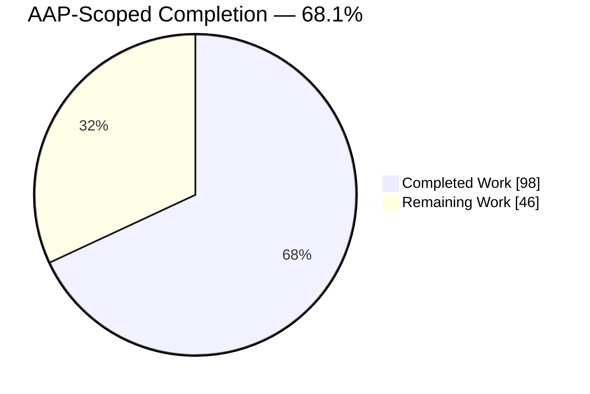
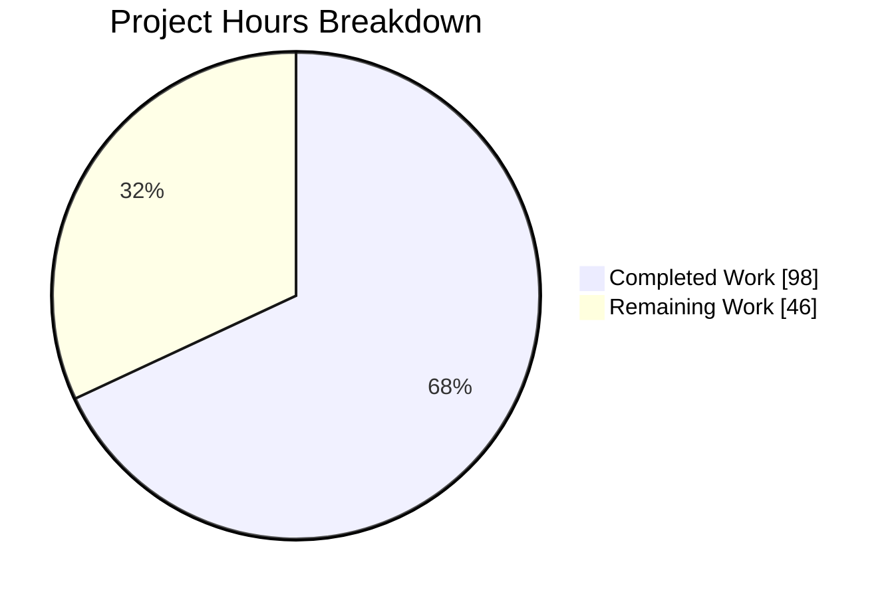
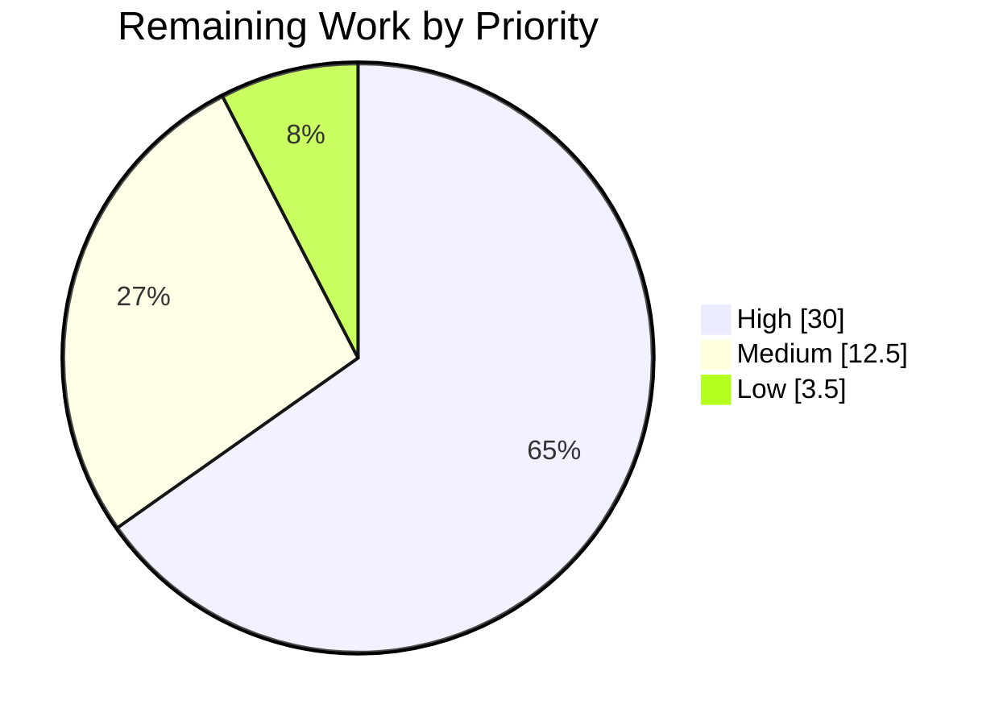
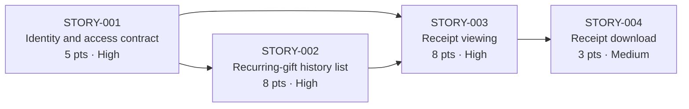

# 1. Executive Summary

## 1.1 Project Overview

This project converts a leadership business objective into an implementation-ready product backlog for a single Epic — **Receipt & Contribution History Self-Service** — for CiviCRM `6.17.alpha1`. The Epic lets a logged-in donor view and download receipts for past contributions generated by their own recurring gifts, without staff involvement. The deliverable is specification, not application code: eight artifacts under `jira-stories/` — an Epic document, four User Stories carrying nine mandated fields each, and three machine-readable exports that load the backlog into JIRA. Product, Engineering and QA sign it off; the implementation run builds against it. It removes the staff hours now spent answering donor receipt requests by hand.

## 1.2 Completion Status



<sub>Completed Work: Dark Blue `#5B39F3` · Remaining Work: White `#FFFFFF`</sub>

| Metric | Value |
|---|---|
| **Total Hours** | **144.0** |
| Completed Hours (AI + Manual) | 98.0 (98.0 AI + 0.0 manual) |
| Remaining Hours | 46.0 |
| **Percent Complete** | **68.1%** |

`98.0 / (98.0 + 46.0) × 100 = 68.1%`. The 46.0 remaining hours cover the decisions this backlog surfaces, sign-off and the JIRA load — not building the portal, which is separate scope.

## 1.3 Key Accomplishments

- One Epic decomposed into four sequenced, estimable User Stories — 24 points, identity → list → view → download.
- 26 acceptance criteria, each evaluable as written rather than dependent on an open decision.
- Nine field values per story identical across four serializations — 144 equality points, zero mismatches.
- Both CSVs and the JSON parse strictly and reproduce byte-for-byte under their declared encoding.
- Every source claim resolves — 302 path citations, 525 line references, 66 files.
- Six security control classes specified normatively, including an ownership gap on a live donor route.
- The JIRA mapping file transforms losslessly under both operator procedures, exercised end to end.
- 15 open questions carried through intact, each owned, classified and repeated verbatim.

## 1.4 Critical Unresolved Issues

**17 items are open.** 15 are the tracked clarification questions this project was commissioned to surface rather than answer — deliverables, not defects. Two are delivery items. The groups sum to 17.

| Issue | Impact | Owner | ETA |
|---|---|---|---|
| 8 of 15 tracked questions are release-blocking (`CLR-01`, `02`, `03`, `05`, `08`, `09`, `10`, `13`) | Fix the authentication surface, donor role, pane host, financial-type policy, un-receipted behaviour, which artifact a donor is shown, invoice-route reuse and status eligibility. Implementation cannot start until each is decided | Product, with Engineering | 19h |
| 5 of 15 are informational (`CLR-04`, `06`, `07`, `11`, `12`) | A defensible default exists for each, so work can proceed while they are confirmed against the target instance | Product / Ops | 5h |
| 2 of 15 are import-blocking only (`IMP-01`, `IMP-02`) | The JIRA target's project type decides which operator transformation the mapping file needs; no bearing on implementation | JIRA administrator | 4h |
| The business objective behind every Business Value field cannot be verified against the sponsor's own document in this environment | Those four fields follow the required citation mapping but are unconfirmed against the sponsor's wording. Blocks clean sign-off (see 5.2) | Business sponsor | 3h |
| STORY-002's performance note rests on a premise the deployed schema contradicts — the recurring-gift filter is index-backed (see 5.2) | Accuracy only. Query-sizing advice is misleading; no functional or security consequence | Engineering | 1.5h |

## 1.5 Access Issues

| System/Resource | Type of Access | Issue Description | Resolution Status | Owner |
|---|---|---|---|---|
| Business objective document (declared 4,097-byte markdown) | Read access to the source input | Not available in this project's environment in any form, and never committed on any branch. Business Value fields were grounded on the approved technical specification's rendering of it instead | Open — escalated; needs provisioning | Business sponsor |
| Target JIRA project | Project type, field configuration, import permission | No target project, project type or credentials are available, so the import cannot be attempted or its field mapping confirmed. Both candidate transformations are documented and were exercised locally | Open — needs a named target project | JIRA administrator |

No other access issue exists. The repository, toolchain, database and sample dataset were all exercised directly.

## 1.6 Recommended Next Steps

1. **[High]** Provision the business objective document and confirm the four Business Value fields against the Epic document's checklists — 3h.
2. **[High]** Decide the eight release-blocking questions, authentication surface and donor role first — 19h.
3. **[High]** Run the Product / Engineering / QA sign-off against the 26 acceptance criteria — 8h.
4. **[Medium]** Identify the target JIRA project and type, apply the matching procedure, dry-run the import — 4h.
5. **[Medium]** Decide whether the invoice-route ownership gap is fixed independently of this Epic — 2h.

# 2. Project Hours Breakdown

## 2.1 Completed Work Detail

| Component | Hours | Description |
|---|---|---|
| Repository grounding and discovery | 20.0 | Six subsystems read at line level to fix the Epic's factual basis — contribution schema, APIv3/APIv4 read paths, SearchKit and Afform, the permission and ACL model, Standalone plus `authx`, and PDF rendering — across 66 files, plus research into JIRA's CSV import contract and its two tracked parent-linking defects |
| Security specification | 14.0 | Six control classes made normative and each tied to source: record-ownership enforcement on single-record reads, binding the authorization decision to the data actually rendered, identifier canonicalization, a non-disclosing refusal contract, the stored-file delivery boundary, and request-integrity / idempotency / retention on any persisting request |
| Epic document (`jira-stories/epics.md`) | 11.0 | 764 lines across nine sections: verbatim Epic definition, roster with dependency graph and priority reasoning, Epic-level grounding, JIRA reconciliation with the mandated caveat and both operator procedures, the 15-item clarification summary, the deferred-Epic note, and the disclosed inferred values |
| STORY-001 — donor identity and self-only access contract | 5.0 | 293 lines, 6 acceptance criteria, 5 points; publishes the four scoping predicates once as the normative statement the other three stories implement, plus the least-privilege donor role contract |
| STORY-002 — recurring-gift history list | 6.5 | 368 lines, 8 acceptance criteria, 8 points; managed saved-search and display design, the query predicate that is the record-level boundary on that path, and the row-level receipt affordance |
| STORY-003 — recurring-gift receipt viewing | 9.0 | 513 lines, 7 acceptance criteria, 8 points, 7 clarifications; the server-side scoped read, the refusal contract, and the reuse-or-replace decision on the existing invoice route |
| STORY-004 — recurring-gift receipt download | 6.5 | 398 lines, 5 acceptance criteria, 3 points; file delivery under the viewing path's enforcement, plus the PDF readiness contract — engine/interpreter compatibility, maintained executable, resource policy and complete-or-nothing failure |
| Machine-readable exports and encoding contract | 8.0 | Nine-column CSV, nine-key typed JSON and the thirteen-column JIRA mapping file with its Epic row specified cell by cell; RFC 4180 profile with unconditional quoting and CRLF records |
| Cross-artifact consistency engineering | 6.0 | One canonical value set serialized four ways, with 144 equality points held under the defined normalization; exports generated from the story documents rather than hand-edited |
| Verification of the delivered set | 12.0 | Contract validation over fileset, encoding, schema, four-way equality, clarification identity and locator resolution; both JIRA operator transformations executed; validation instruments proved against deliberate corruption |
| **Total** | **98.0** | |

## 2.2 Remaining Work Detail

| Category | Hours | Priority |
|---|---|---|
| Business objective provenance closure and Business Value confirmation | 3.0 | High |
| Resolution of the eight release-blocking clarification questions | 19.0 | High |
| Product / Engineering / QA sign-off review of the eight artifacts | 8.0 | High |
| Confirmation of the five informational clarifications against the target instance | 5.0 | Medium |
| JIRA target determination, operator transformation and import verification | 4.0 | Medium |
| Decision on independent remediation of the existing invoice-route ownership gap | 2.0 | Medium |
| Correction of the recurring-filter index premise across the four serializations | 1.5 | Medium |
| Repository-resident validation guard for the artifact set | 3.5 | Low |
| **Total** | **46.0** | |

## 2.3 Hours Reconciliation

| Check | Result |
|---|---|
| Section 2.1 total | 98.0 |
| Section 2.2 total | 46.0 |
| 2.1 + 2.2 = Total Project Hours (Section 1.2) | 98.0 + 46.0 = 144.0 ✅ |
| Remaining hours identical in Sections 1.2, 2.2 and 7 | 46.0 ✅ |
| Completion percentage | 98.0 / 144.0 × 100 = 68.1% ✅ |
| Section 7 pie values | Completed 98 · Remaining 46 ✅ |
| Human task list (Section 8 and Section 2.2) | 30.0 High + 12.5 Medium + 3.5 Low = 46.0 ✅ |

Confidence: **High** on the completed side, which is measured against artifacts that can be counted — 504,293 bytes across 5,108 lines, 26 acceptance criteria, 24 story points and 302 verified citations. **Medium** on the remaining side, driven by one open-ended investigation (`CLR-09`, whether a historically issued receipt can be identified from stored file and activity records) and by the number of sign-off round-trips the backlog needs.

# 3. Test Results

Every figure below was observed by executing the check. Counts are executed assertions, tests or file compiles as noted per row. The contract harness ran twice in fresh processes with byte-identical output, and was proved against 12 deliberate corruptions of the artifacts — each was detected with a precise diagnostic — so a pass here means something.

| Area / Category | Framework | Tests | Passed | Failed | Coverage | What This Proves |
|---|---|---|---|---|---|---|
| Backlog structure and acceptance criteria | Contract harness (Python 3.13) | 87 | 87 | 0 | 8 of 8 artifacts, 36 field values, 26 criteria | The deliverable is exactly eight files with nothing written outside the backlog directory, and every story carries the nine mandated fields in order with criteria at the fixed 6/8/7/5 counts |
| Export encoding and schema | Contract harness | 204 | 204 | 0 | Both CSVs and the JSON, byte level | Both CSVs and the typed JSON parse strictly and reproduce byte-for-byte under their declared profile, so any importer or spreadsheet reads the same values — with no formula-prefixed cell anywhere |
| Cross-artifact field equality | Contract harness | 144 | 144 | 0 | 9 fields × 4 stories × 4 serializations | One canonical value set holds across the story documents, the native CSV, the JSON and the mapping file, so a JIRA load cannot silently disagree with what a reviewer signed |
| JIRA hierarchy and import transformation | Contract harness + both operator procedures executed | 186 | 186 | 0 | 13-column mapping file and both target variants | The Epic row parents all four stories under both candidate JIRA targets, losslessly and without mutating the source file, and the Epic's own parent cell stays empty so it cannot self-parent |
| Clarification inventory, Epic content and sequencing | Contract harness | 148 | 148 | 0 | 15 questions across 5 sites each; 4 graph edges | Every open question survives verbatim everywhere it appears, correctly owned and classified, and the mandated sequencing is a property of the data rather than of row order |
| Source citation resolution | Contract harness | 840 | 840 | 0 | 302 paths, 525 line references, 13 internal links, 66 files | Every claim the backlog makes about the codebase points at a file and a line that exists, so a reader can check the reasoning rather than trust it |
| Host suites at the named extension points, and compile integrity | PHPUnit 9.6.36 · `php -l` (PHP 8.4.11) | 3,753 | 3,753 | 0 | 2 cited test classes (288 assertions); 3,743 PHP files | The donor-dashboard link coverage and invoice rendering coverage that the receipt stories extend both exist and pass, and the entire PHP tree compiles cleanly |
| Environment-gated checks | Contract harness · Karma 6.3.16 / Jasmine | 82 | 26 | 56 | 1 source-input probe; 81 JavaScript specs | Nothing about the backlog. The single failing contract assertion is the absent source document reported in 1.4, and all 55 JavaScript failures cascade from one unloaded third-party AngularJS asset in the harness, on a branch that changes no JavaScript |

### Not Covered

- **The 26 acceptance criteria are not executed by any test.** They describe donor-portal behaviour that does not exist yet; the implementation run verifies them. Before release, a human should re-read each one for evaluability — that is the single highest-value manual check on this deliverable.
- **No validation guard lives in the repository.** Every check above ran from outside the backlog directory, which the delivery contract fixes at eight files. A future hand edit to an export can therefore drift from its story document silently. Section 9 gives the commands to re-check; Section 2.2 budgets committing them.
- **The Business Value wording cannot be tested here.** The four fields are known to follow the required citation mapping, but confirming them against the sponsor's own document is a human comparison against the Epic document's pain-point and success-criterion lists.
- **The full host test suites were not run to completion.** Three PHPUnit suites covering 681 test classes and the JavaScript suite exist; the branch changes no PHP and no JavaScript, so none of their subject matter is implicated. A reader who wants a clean baseline before implementation should resolve the JavaScript harness's asset-loading condition first, since it is unrelated to this work and will otherwise mask real regressions.
- **No JIRA import was performed.** Both operator transformations were exercised as local transformations only; the target project type is still unknown.
- **Donor authentication, receipt generation and PDF rendering were never exercised as this Epic's behaviour**, because no such code is delivered. What was exercised at runtime is the existing system the backlog describes — see Section 4.

# 4. Runtime Validation & UI Verification

This delivery is a specification, so there is no new runtime surface to drive. What was driven instead is the **existing system the backlog makes claims about** — a CiviCRM 6.17.alpha1 Standalone instance with the bundled sample data, exercised through a real browser and a live database, so that every assertion the four stories rest on was confirmed against behaviour rather than against source alone.

- ✅ **Standalone login screen** — Renders at the instance's configured base URL with a working username/password form, both fields marked required, a password-reset link and a submit control; clean at a 390 px mobile viewport; zero console errors and no failed subresources.
- ⚠ **Origin sensitivity of Angular screens** — Reaching the same server on a literal loopback-address origin instead of its configured host name leaves the login card rendering only the logo: the AngularJS module manifest becomes cross-origin and is CORS-blocked. Section 9 records the working origin.
- ✅ **Donor authentication** — A donor account authenticates successfully: the login call returns 200, the session cookie is rotated on privilege change, and the page's asset token carries that donor's contact identifier. The account resolves to an effective permission set of exactly zero.
- ⚠ **Donor dashboard access for a donor account** — The dashboard route redirects that authenticated donor to an access-denied page. This is the current-state gap the Epic closes, and it confirms the backlog's premise: no seeded role grants a donor dashboard access. The denial page also carries no navigation and no sign-out control, so an unentitled donor has no route back into the site.
- ✅ **Donor dashboard renders under an entitled role** — With an entitled role temporarily assigned, the dashboard renders seven always-open panes, contributions first, served by the form-builder dashboard rather than the legacy template. This is the direct evidence that a read-only history view needs no custom component.
- ⚠ **Contributions pane scoping** — The live saved search carries exactly one predicate, the contact match, with ACL bypass on and actions off. Of seven rows rendered for the fixture donor, five are recurring-gift contributions and two are one-time, and no column distinguishes them — the recurring, non-test and past-dated predicates the Epic introduces are genuinely absent.
- ⚠ **Receipt affordance on the pane** — None exists. All five columns are plain read-only fields with no link configuration, the rendered rows contain no anchors or buttons at all, and the only occurrence of the word "receipt" is a column heading showing a send date that is blank on almost every row. Sibling panes on the same screen do render working links and buttons, so this is real absence rather than a rendering artifact.
- ⚠ **Existing invoice download route** — Refused for the unentitled donor even for their own contribution, so the ownership weakness cannot be demonstrated without granting broad privilege; it was instead confirmed by reading the access callback, which tests the caller's own identifier and never the requested record's owner (`CRM/Core/Permission.php:1866`).
- ❌ **Profile view route for an authenticated donor** — Returns a handled 500 error page where an anonymous request returns a clean refusal. Pre-existing behaviour of the installed instance, unrelated to this delivery and outside the Epic's boundary; recorded because it was observed.
- ✅ **No side effects on the instance** — After all exercises, contribution, contact and activity counts were unchanged, the stored-file table remained empty (so no invoice document or activity write was ever triggered), and the temporary role assignment was revoked with the refusal re-verified.

**Never exercised at runtime.** None of the capability this Epic specifies — donor-scoped recurring-gift listing, receipt viewing, receipt download, PDF rendering or the non-disclosing refusal contract — was exercised, because none of it exists yet; the four stories are the instruction to build it. No JIRA instance was contacted, so the import remains verified only as a local transformation. The two external PDF binaries the backlog treats as a host prerequisite were not present to test, which is precisely why that prerequisite is written into the download story rather than assumed.

# 5. Compliance & Quality Review

## 5.1 Compliance Matrix

Status is where each deliverable stands now, verified by the checks in Section 3.

| # | Deliverable | Benchmark | Status | Progress |
|---|---|---|---|---|
| 1 | Epic definition and business framing (`jira-stories/epics.md`) | Single Epic identity; controlling definition reproduced without alteration | ✅ Pass | 100% |
| 2 | Four story documents | Exactly nine mandated fields per story, in the mandated order, no tenth field | ✅ Pass | 100% |
| 3 | Acceptance criteria | 26 criteria at the fixed 6/8/7/5 counts, checkbox syntax, each evaluable as written | ✅ Pass | 100% |
| 4 | Native export (`jira-stories/stories-export.csv`) | Nine columns in order, four data rows, RFC 4180 with every field quoted | ✅ Pass | 100% |
| 5 | Structured export (`jira-stories/stories-export.json`) | Array of four objects, exactly nine keys, typed points and arrays | ✅ Pass | 100% |
| 6 | Import mapping (`jira-stories/jira-import-mapping.csv`) | Thirteen columns; Epic row first with its own parent cell empty; Components blank throughout | ✅ Pass | 100% |
| 7 | Sequencing, estimation and priority | Acyclic graph placing scoping before listing before receipts; Fibonacci points rolling to 24; priority rule applied with its exception clause | ✅ Pass | 100% |
| 8 | Clarification inventory | 13 story-level and 2 import-level questions, each owned, classified and carried verbatim into every place it appears | ✅ Pass | 100% |
| 9 | Import caveat and operator procedures | Mandated caveat reproduced word for word, exactly once; both target-specific procedures stated in full and executable | ✅ Pass | 100% |
| 10 | Deferral of the remaining three Epics | Named as deferred, undrafted, with the staff-visibility logging criterion carried forward intact | ✅ Pass | 100% |
| 11 | Business Value provenance | All four fields traced to the sponsor's own pain points and success criteria | ⚠ Partial | 85% |
| 12 | Codebase citation accuracy and run discipline | Every claim resolves to a real path and line; nothing written outside the backlog directory; no dependency or code change | ⚠ Partial | 95% |

## 5.2 AAP & Rule Divergences and Gaps

No user-specified rules were supplied for this project, so every divergence below is a divergence from the Agent Action Plan. Seven were identified.

| What the AAP/Rule Required | What Was Delivered Instead | Why It Diverged | Impact | Remediation |
|---|---|---|---|---|
| The recurring-gift filter is unindexed, and the listing story must carry that as a performance fact | STORY-002 leads with a bolded "unindexed" heading and sizing advice, while an index on that column does exist in the deployed schema | The premise came from the plan and was checked only against the entity-type declaration's explicit index block, which does not list foreign-key-implied indexes | Accuracy of one Technical Note; misdirects the implementation run's query sizing | Correct the heading and sizing advice; re-verify cross-artifact equality (1.5h, Section 2.2) |
| Every Business Value field is grounded in the sponsor's business-objective document, which is the source of truth for that field | Fields grounded on the approved technical specification's rendering of that document, with a full chain of custody published in the Epic document | The document was never committed to any branch and is not available in this project's environment; fabricating it was forbidden, and so was adding a ninth artifact to hold a substitute | Product cannot sign off the value statements until the wording is compared against the original | Provide the original, confirm four fields against the published checklist, re-serialize (3.0h) |
| One clarification's wording is frozen exactly as the plan specifies it | The frozen wording is preserved, and it names one in-core status precedent as the only one, which is not true | The plan froze a sentence written before a second precedent was located; changing frozen text was prohibited, so the corrected reading was placed adjacent instead | A reader acting on the marker alone sees one precedent, not two | Weigh both precedents when deciding donor status eligibility (folded into the 3.5h decision task) |
| One clarification's wording ends with a pointer to the comparison of the three hosting options | The delivered wording ends one sentence earlier, matching the plan's own inventory table rather than its story text | The plan states the same question twice with different endings; the inventory form was chosen for the required verbatim identity across five places | None — the comparison it pointed at is in the story that raises the question | None required |
| Acceptance criteria render as markdown list items | Criteria render as bare checkbox-prefixed lines | Deliberate: it keeps the markdown line byte-identical to its CSV cell line and JSON array element, which is what the four-way equality contract requires | Criteria render as plain lines rather than bullets in some viewers | None required; the reasoning is published in the Epic document |
| Repository style declares LF line endings for all files | Both CSV exports use CRLF | The plan mandates CRLF for RFC 4180 and comma-delimited import interoperability, which overrides the general style rule for these two files | None functionally; a diff tool may flag the endings | None required |
| Cross-artifact consistency is the highest-risk defect class in this deliverable | The consistency contract is fully satisfied but is enforced by nothing inside the repository | The deliverable is fixed at eight files, so no harness could be committed alongside it | A future hand edit to one export can drift from the story documents undetected | Authorize a ninth path and commit a validation guard (3.5h, Section 2.2) |

**Recurring-filter index premise.** STORY-002's Technical Notes lead with a bolded claim that no index covers the recurring-gift column, and advise sizing the query work accordingly. The body text around it is correctly bounded to what the entity-type declaration lists, but the deployed schema declares a foreign-key constraint on that column (`sql/civicrm.mysql:2641`) and the running database reports the corresponding B-tree index. The heading therefore rests on a premise the database does not support. Nothing else in the backlog depends on it. A human should correct the heading and the sizing advice, then re-run the equality check so the same wording lands in all four serializations.

**Business-objective document unobtainable.** The plan designates a 4,097-byte markdown document as the source of truth for every Business Value field. It was never committed on any branch and is not available in this project's environment in any form; the only surviving rendering of its content is the one inside the approved technical specification. Rather than invent wording or add an unauthorized ninth file, the delivery grounded the four fields on that rendering and published a full chain of custody in `jira-stories/epics.md` — media type, byte size, the pointer to where the content survives, an explicit statement that the document is not in this checkout, and a three-part review checklist. Product must supply the original and confirm the four fields before sign-off. This blocks sign-off, not implementation.

**Frozen clarification asserts a false exhaustive claim.** The frozen text of the receipt-status question names the staff invoice form's four-status set as the only in-core precedent for which contributions may be receipted. A second precedent exists: the print-receipts task permits completed contributions only (`CRM/Contribute/Form/Task/PDF.php:38-48`). The plan requires that marker text be reproduced exactly and identically in five places, so it was preserved and the corrected two-precedent reading was placed immediately adjacent in STORY-003's Technical Notes. A reader who acts on the marker in isolation — for instance from the exported CSV — will see one precedent. Whoever decides donor status eligibility must weigh both, and the narrower one materially changes the answer.

**Hosting-question marker trimmed of a pointer.** The plan states the pane-hosting question twice: once inside STORY-002, ending with a pointer to the section that compares the three hosting options, and once in its clarification inventory, ending at the question itself. The delivered marker follows the inventory form. This was necessary rather than preferential: the same question text must appear byte-identically in the owning story, in the Epic document's closing summary and in three exports, and only one of the two candidate endings can hold everywhere. Nothing is lost — the three-way comparison the trimmed pointer referenced is present in the story that raises the question. No remediation is needed.

**Criteria as bare lines rather than list items.** The plan describes acceptance criteria rendering as markdown list items. They render instead as bare lines each opening with the checkbox marker. This is a deliberate consequence of the equality contract: the same criterion must be recoverable, character for character, from the story document, from a line inside a quoted CSV cell and from a JSON array element. A leading list bullet would exist in one representation and not the others, and normalising it away would weaken the strongest check on this deliverable. The choice and its reasoning are documented in the Epic document's encoding section, so a reviewer can overrule it knowingly.

**CRLF exports against declared LF style.** The repository's style file declares LF endings for every file. Both CSV exports use CRLF. The plan mandates CRLF explicitly, because these files exist to be consumed by a comma-delimited importer and RFC 4180 specifies CRLF; interoperability with the target tool outranks a general in-repository style rule for two files that no build step reads. The markdown artifacts are CR-free and every file is UTF-8 without a byte-order mark, so the divergence is confined to exactly where it is justified. A diff or lint tool may flag the endings; changing them would risk the import.

**No repository-resident validation guard.** The delivery contract fixes this backlog at eight files, which leaves no room to commit the harness that enforces its own consistency rules. The four-way equality contract — nine fields, four stories, four serializations — is fully satisfied today and was verified from outside the tree, but nothing prevents a future hand edit to one export from diverging from its story document, and such a drift imports into a broken hierarchy silently. The plan itself names this the highest-risk defect class in the deliverable. Closing it requires a human to authorize a ninth path and commit a guard covering the file set, encoding, equality, clarification identity and citation resolution.

# 6. Risk Assessment

These are forward-looking: what can still go wrong when this backlog is implemented and the donor portal reaches production. The first four are properties of the existing CiviCRM codebase that the Epic must confront; the last four attach to the delivery itself.

| # | Risk | Category | Severity | Probability | Mitigation | Status |
|---|---|---|---|---|---|---|
| 1 | The existing donor invoice route authorizes the caller but never the requested record, so a donor holding the invoice permission can retrieve another donor's invoice by supplying their own contact identifier with any contribution identifier (`CRM/Core/Permission.php:1866`) | Security | Critical | Medium | The receipt stories cannot be satisfied by reusing that route unmodified; the harden-or-replace decision is a blocking question, and the non-disclosing refusal contract is asserted against an identical case list in both receipt stories | Open — human decision required |
| 2 | No least-privileged donor role exists. The only seeded role granting dashboard access carries 77 permissions including view, edit and delete contacts; assigning it to donors would expose the entire contact database | Security | High | Medium | STORY-001 makes identifying or creating a least-privileged role explicit work and forbids the over-privileged permissions by name; the purpose-built donor invoice permission (`CRM/Core/Permission.php:958-959`) is the least-privilege candidate | Open — human decision required |
| 3 | On the ACL-bypassing dashboard display, a single query predicate is the entire record-level boundary; the generic contact ACL clause and the financial-type filter are both short-circuited, so one predicate error is an unmediated cross-donor leak | Security | High | Low | The scoping rule is defined once and referenced rather than restated; predicates stay inside the saved search and no contact identifier is exposed as a filter; ACL bypass is settable only by super-administrators (`ext/search_kit/CRM/Search/BAO/SearchDisplay.php:59-87`) | Mitigated by design |
| 4 | The PDF path can fetch remote resources by default and can be configured to a discontinued rendering engine, and the setting validator checks only that the file exists and is executable (`CRM/Core/BAO/Setting.php:338-354`) | Security | High | Medium | STORY-004 makes rendering readiness a preliminary prerequisite with four explicit conditions covering wrapper compatibility, engine maintenance status, remote fetching and failure behaviour | Open — host verification required |
| 5 | Eight of the fifteen tracked questions are release-blocking for the implementation run: authentication surface, donor role, pane hosting, invoice-route reuse, receipt reproduction, un-receipted behaviour, status eligibility and financial-type policy | Operational | High | High | Each is owned by a named story, classified blocking or informational, and carried verbatim into every artifact a reviewer might read; Section 2.2 budgets the decision time | Open by design — this is the backlog working as intended |
| 6 | Nothing inside the repository enforces the 144-point cross-serialization contract, so a hand edit to one export can drift from the story documents undetected and import into a broken hierarchy silently | Technical | High | Medium | Verified clean today and re-checkable with the commands in Section 9; a committed guard is budgeted in Section 2.2 | Open |
| 7 | The backlog is written against a pre-release CiviCRM version and cites two alpha-stage extensions; 302 file paths and 525 line references can move under it, and the identity layer it depends on warns against production use | Technical | Medium | Medium | Every claim is bounded to an addressable path and line so drift is detectable rather than silent; the alpha caution is carried into every dependent story | Open — re-verify at implementation |
| 8 | The JIRA hierarchy will not import in one pass on either candidate target, and the target project type is unknown; current projects need numeric parent identifiers the mandated schema cannot carry, legacy ones need a second column | Integration | Medium | High | Both operator procedures are documented in full, executed and verified lossless; the mandated caveat travels with the file; the Epic row is placed first so a parent exists before its children | Mitigated — procedure ready, target unconfirmed |

# 7. Visual Project Status

**Overall progress — 68.1% of AAP-scoped hours complete**



<sub>Chart colours — Completed Work: Dark Blue `#5B39F3` · Remaining Work: White `#FFFFFF` · Accent: Violet-Black `#B23AF2` · Highlight: Mint `#A8FDD9`</sub>

**Priority distribution of the 46.0 remaining hours**



**Remaining hours per category** — the eight categories from Section 2.2, summing to 46.0.

| Category | Hours | Priority | Share |
|---|---|---|---|
| Resolution of the eight release-blocking clarification questions | 19.0 | High | ████████████████████ 41.3% |
| Product / Engineering / QA sign-off review of the eight artifacts | 8.0 | High | ████████ 17.4% |
| Confirmation of the five informational clarifications | 5.0 | Medium | █████ 10.9% |
| JIRA target determination, transformation and import verification | 4.0 | Medium | ████ 8.7% |
| Repository-resident validation guard for the artifact set | 3.5 | Low | ███▌ 7.6% |
| Business objective provenance closure and Business Value confirmation | 3.0 | High | ███ 6.5% |
| Decision on independent remediation of the invoice-route ownership gap | 2.0 | Medium | ██ 4.3% |
| Correction of the recurring-filter index premise | 1.5 | Medium | █▌ 3.3% |
| **Total** | **46.0** | | **100%** |

**Delivered artifact set** — eight files, 5,108 lines, all created on this branch and nothing else touched.

| Artifact | Lines | Bytes | Role |
|---|---|---|---|
| `jira-stories/epics.md` | 764 | 46,907 | Epic definition, roster, JIRA reconciliation, clarification summary, deferral note |
| `jira-stories/STORY-001-donor-identity-and-self-only-scoping.md` | 293 | 20,584 | Identity and access contract — 6 criteria, 5 points |
| `jira-stories/STORY-002-recurring-contribution-history-list.md` | 368 | 25,084 | Scoped history list — 8 criteria, 8 points |
| `jira-stories/STORY-003-recurring-gift-receipt-viewing.md` | 513 | 39,331 | Receipt viewing — 7 criteria, 8 points |
| `jira-stories/STORY-004-recurring-gift-receipt-download.md` | 398 | 29,568 | Receipt download — 5 criteria, 3 points |
| `jira-stories/stories-export.csv` | 1,288 | 110,575 | Nine-column native export |
| `jira-stories/stories-export.json` | 103 | 112,930 | Nine-key typed export |
| `jira-stories/jira-import-mapping.csv` | 1,381 | 119,314 | Thirteen-column import mapping, Epic row first |

**Story sequencing** — the dependency graph the Epic requires, verified acyclic with exactly these four edges.



# 8. Summary & Recommendations

**What was delivered.** A complete, sequenced, estimable product backlog for one Epic — *Receipt & Contribution History Self-Service* — as eight artifacts under `jira-stories/`: an Epic document, four User Stories each carrying nine mandated fields, and three machine-readable exports. Twenty-six acceptance criteria are written to be evaluable as they stand, 24 story points roll up across a four-node dependency graph, and the whole set is grounded in the CiviCRM codebase rather than in assumption: 302 file paths and 525 line references, every one of which resolves. Nothing outside the backlog directory was written, no dependency was touched and no application code was changed. Against AAP scope the project stands at **68.1% complete — 98.0 of 144.0 hours**.

**What was verified, and how far.** The deliverable was validated as a contract rather than read for plausibility. Its file set, encoding, schema, four-way field equality, clarification identity, sequencing and citation resolution were all checked by execution — 1,454 contract assertions, one failure, and that failure is an absent input rather than a defect in the work. The instrument itself was proved by corrupting the artifacts twelve different ways and confirming each corruption was caught. Both JIRA operator transformations were executed and shown lossless without mutating the source file. Beyond the artifacts, the claims they make were tested against a running CiviCRM instance: the absence of a least-privileged donor role, the single-predicate scoping of the existing contributions pane, and the complete absence of any receipt affordance on it were all confirmed live, and the two PHPUnit classes the receipt stories name as extension points were run and pass. The ownership weakness on the existing invoice download route was confirmed by reading its access callback, which authorizes the caller and never the record.

**What remains, and what it is not.** The 46.0 remaining hours are the cost of turning a signed-off backlog into a loaded, decided one — not the cost of building the portal, which is separate scope. Nineteen of those hours are the eight release-blocking product decisions the backlog exists to surface: the authentication surface, the donor role, where the pane is hosted, whether the existing invoice route is hardened and reused, which artifact a donor is actually shown, what happens for a contribution that was never receipted, which statuses are receiptable, and whether financial-type policy applies. These are open by design; a backlog that had guessed them would be worse, not better. Eight further hours are the Product, Engineering and QA sign-off review. The genuine gaps are narrower and specific: the sponsor's business-objective document could not be reached, so four Business Value fields are grounded on the approved technical specification's rendering of it and need human confirmation; one performance note in the history-list story rests on an index premise the deployed schema contradicts; and no guard inside the repository protects the cross-serialization contract, because the deliverable is fixed at eight files.

**Critical path to production.** Provision the business objective and confirm the four value fields, because that is what blocks clean sign-off. Then take the two foundation decisions — authentication surface and donor role — since every read in the Epic depends on them, and the only seeded role granting dashboard access carries view, edit and delete rights over the entire contact database. Then settle the invoice-route question, which decides whether the receipt stories harden existing code or specify new code, and therefore changes their shape. Sign-off follows, then the JIRA load once the target project type is known. Everything else can run in parallel.

**Production readiness.** The backlog is ready for review now and ready for implementation once the eight blocking questions are answered. Success is measurable against criteria the deliverable already states: a donor sees only their own past recurring-gift contributions, both receipt verbs work for eligible contributions, no staff involvement is required, and every refusal is indistinguishable from a record that does not exist. The single most important thing a reader should carry away is that the Epic cannot be delivered by reusing the existing donor invoice route unmodified — its access check does not verify record ownership, and the Epic's own boundary is precisely that constraint.

### Prioritized Human Task List

| # | Task | Priority | Hours |
|---|---|---|---|
| H1 | Provision the business objective document; confirm the four Business Value fields against the Epic document's pain-point, success-criterion and attribution checklists; re-serialize any correction into all four artifacts. Do not author a substitute document | High | 3.0 |
| H2 | Decide the donor authentication surface and identify or create the least-privileged donor role, excluding view/edit/delete contacts and uploaded-file access (`CLR-01`, `CLR-02`) | High | 4.0 |
| H3 | Decide where the donor pane is hosted — legacy dashboard, the form-builder dashboard, or a new extension surfacing through the existing tag mechanism (`CLR-03`) | High | 2.0 |
| H4 | Decide whether the existing invoice route is hardened and reused or replaced, and whether its stored-file and activity writes are acceptable for a donor read (`CLR-10`) | High | 3.0 |
| H5 | Investigate whether a historically issued receipt can be identified from stored file and activity records, or whether receipts are regenerated from current data (`CLR-09`) | High | 5.0 |
| H6 | Decide donor status eligibility weighing **both** in-core precedents, and behaviour for a contribution with no recorded receipt date (`CLR-13`, `CLR-08`) | High | 3.5 |
| H7 | Decide financial-type policy for donor receipts and confirm whether financial access controls are enabled on the target instance (`CLR-05`) | High | 1.5 |
| H8 | Product / Engineering / QA sign-off review of all eight artifacts against the 26 acceptance criteria | High | 8.0 |
| M1 | Determine the target JIRA project and its type, apply the matching operator procedure, dry-run the import and verify the hierarchy (`IMP-01`, `IMP-02`) | Medium | 4.0 |
| M2 | Confirm the five informational clarifications against the target instance — pane presentation, receipt shape, invoicing setting, failed/cancelled visibility, file format and engine binary (`CLR-04`, `06`, `07`, `11`, `12`) | Medium | 5.0 |
| M3 | Correct the recurring-filter index claim and its sizing advice, then re-verify cross-artifact equality | Medium | 1.5 |
| M4 | Decide whether the invoice-route ownership gap is remediated independently of this Epic | Medium | 2.0 |
| L1 | Authorize a ninth repository path and commit a validation guard covering file set, encoding, four-way equality, clarification identity and citation resolution | Low | 3.5 |
| | **Total** | | **46.0** |

# 9. Development Guide

Two things can be done with this repository: read and validate the backlog, which needs nothing but Python 3; and stand up the CiviCRM instance the backlog is written against, which needs the full toolchain. Both are covered. Every command below was executed against this checkout, and the outputs quoted are the ones observed.

### System Prerequisites

| Component | Version verified | Notes |
|---|---|---|
| PHP | 8.4.11 | Extensions required: `mysqli`, `intl`, `gd`, `curl`, `mbstring`, `zip`, `bcmath`, `soap`, `xml`, `opcache` |
| Composer | 2.10.3 | Run with `COMPOSER_ALLOW_SUPERUSER=1` in a container |
| Node.js / npm | 22.23.2 / 11.18.0 | No `engines` field or `.nvmrc` in the repository — do not downgrade |
| MariaDB (or MySQL 8.0) | 11.8.3 server, 15.2 client | Time-zone tables must be loaded; `CONVERT_TZ` is used |
| PHPUnit | 9.6.36 | Version 9 is mandatory — `phpunit.xml.dist` uses schema 9.3. Deliberately not a Composer dependency; do not add it |
| `cv` | 0.3.72 | CiviCRM command-line tool; required for bootstrap, API calls and the JS harness |
| Chrome | 151 | Needs `--no-sandbox --disable-dev-shm-usage --disable-gpu` when run as root |
| Git / Git LFS | 2.51.0 / 3.7.1 | The four non-sample hooks in `.git/hooks` are Git LFS shims |
| Python | 3.13 | Only needed to re-validate the backlog exports |

### Reading and Validating the Backlog

No build, no server and no database. From the repository root:

```bash
# The Epic, its roster and the JIRA reconciliation section
head -12 jira-stories/epics.md

# The four stories, in dependency order
ls -1 jira-stories/STORY-*.md

# Acceptance criteria counts — expect 6, 8, 7, 5
for f in jira-stories/STORY-*.md; do printf '%s  ' "$(grep -c '^\[ \] ' "$f")"; echo "$f"; done
```

Verify the exports parse and agree with each other:

```bash
# Both CSVs: shape and strict RFC 4180 parse
python3 - <<'PY'
import csv
for path, cols in (("jira-stories/stories-export.csv", 9),
                   ("jira-stories/jira-import-mapping.csv", 13)):
    with open(path, newline="", encoding="utf-8") as fh:
        rows = list(csv.reader(fh))
    assert all(len(r) == cols for r in rows), path
    print(f"{path}: {len(rows)} rows x {cols} cols OK")
PY

# JSON: four objects, nine ordered keys, integer points summing to 24
python3 - <<'PY'
import json
d = json.load(open("jira-stories/stories-export.json", encoding="utf-8"))
assert len(d) == 4
pts = [o["Story Points"] for o in d]
assert all(isinstance(p, int) for p in pts)
print("keys:", len(d[0]), "| points:", pts, "| sum:", sum(pts))
PY
```

Observed: `stories-export.csv` 5 rows × 9 columns; `jira-import-mapping.csv` 6 rows × 13 columns; JSON 4 objects, 9 keys, points `[5, 8, 8, 3]` summing to 24.

Check the encoding profile — this is the contract that keeps a spreadsheet and an importer reading the same bytes:

```bash
python3 - <<'PY'
for p in ("jira-stories/stories-export.csv", "jira-stories/jira-import-mapping.csv"):
    b = open(p, "rb").read()
    print(p, "| bytes", len(b),
          "| BOM", b.startswith(b"\xef\xbb\xbf"),
          "| lone CR", b.replace(b"\r\n", b"").count(b"\r"))
PY
```

Observed: no byte-order mark on either file and zero lone carriage returns, so every record terminator is a well-formed CRLF.

Confirm the clarification inventory is intact — 13 story-level and 2 import-level questions:

```bash
grep -o 'CLR-[0-9][0-9]' jira-stories/epics.md | sort -u | wc -l   # 13
grep -o 'IMP-0[0-9]'      jira-stories/epics.md | sort -u | wc -l   # 2
```

### Transforming the Mapping File for a JIRA Import

The mapping file is a reviewed starting point, not a one-pass import. Which transformation you need depends on the target project, and that is an open question — see Section 1.4. Both procedures are documented in full in the Epic document's JIRA reconciliation section, and both are mechanical:

- **Current Jira Cloud target** — add an `Issue ID` column with a unique number on every row and a `Parent` column holding the Epic row's numeric `Issue ID` on each story row, leaving the Epic's own parent cell empty. Mapping the existing `Epic Link` column to `Parent` will fail, because it holds a name and the importer requires the number.
- **Legacy company-managed target** — add an `Epic Name` column populated only on the Epic row with the same Epic name string, then map `Title` to Summary, `Epic Name` to Epic Name and `Epic Link` to Epic Link. Column mapping is per column, not per row, so `Title` cannot mean two things.

Either way the Epic row stays first: importers process rows top to bottom, and a parent must exist before its children. Both transformations were executed against this file and verified lossless on every non-hierarchy cell, with the source file left byte-identical.

### Standing Up the CiviCRM Instance

Only needed to exercise the system the backlog describes. Three things are absent from the checkout by design and must be provided first:

```bash
# 1. The companion packages repository — without it CRM/Core/DAO.php cannot load
git clone --depth 1 --branch 6.17 https://github.com/civicrm/civicrm-packages.git packages

# 2. PHP dependencies (~4 min)
COMPOSER_ALLOW_SUPERUSER=1 composer install --no-interaction --prefer-dist

# 3. JS dependencies, plus the Chrome launcher karma.conf.js needs but package.json omits
CI=true npm install --no-audit --no-fund
CI=true npm install --no-save --no-audit karma-chrome-launcher@3.2.0
```

Use `--no-save` on the last one: `package.json` and `package-lock.json` must stay byte-identical.

Provision your own web root and databases. The Standalone layout is not negotiable — the installer walks up from the source path looking for `civicrm.standalone.php` and hardcodes `<webroot>/core` as the CiviCRM root, so `core` must be a symlink to your checkout:

```bash
export WEBROOT=/opt/civicrm-clones/c9          # any directory outside the checkout
export SITE_DB=civicrm_c9 TEST_DB=civicrm_c9_test
export APP_PORT=8170 KARMA_PORT=8171
export CIVICRM_BASE_URL=http://localhost:$APP_PORT
export CIVICRM_SETTINGS=$WEBROOT/private/civicrm.settings.php
export CV_CONFIG=$WEBROOT/cv.json

mkdir -p $WEBROOT/private/{cache,log,l10n,attachment,tmp} $WEBROOT/public/media $WEBROOT/ext
ln -sfn "$(pwd)" $WEBROOT/core
```

Copy the scaffold (`index.php`, `civicrm.standalone.php`, `router.php`, `.htaccess`) and the settings and `cv.json` templates from the reference instance, rewriting the paths and database names for your own web root. Create both databases, restore the provided baseline snapshot into the site database, leave the test database **empty**, then `cv flush`.

Serve it and confirm it boots:

```bash
nohup php -S 127.0.0.1:$APP_PORT -t $WEBROOT $WEBROOT/router.php \
  > $WEBROOT/private/log/php-server.log 2>&1 &
echo $!   # keep this pid — stop the server by pid, never by process name

cv vars:show | head -20          # expect CIVI_VERSION 6.17.alpha1
curl -s -o /dev/null -w '%{http_code}\n' $CIVICRM_BASE_URL/civicrm/login   # 200
```

The bare `php -S` without `router.php` returns 404 for every route — the router mirrors the `.htaccess` contract and serves assets through the `core` symlink.

### Running the Tests

PHP unit tests, pointed at your **empty** test database:

```bash
CIVICRM_UF=UnitTests \
CIVICRM_DSN=mysql://civicrm:<password>@127.0.0.1:3306/$TEST_DB \
CIVICRM_SETTINGS=$WEBROOT/private/civicrm.settings.php CV_CONFIG=$WEBROOT/cv.json \
phpunit9 -c phpunit.xml.dist --colors=never \
  tests/phpunit/CRM/Contact/Page/View/UserDashBoardTest.php
```

Observed: `OK (6 tests, 170 assertions)` in 20.2 s. The other class the receipt stories extend:

```bash
... phpunit9 -c phpunit.xml.dist --colors=never \
  tests/phpunit/CRM/Contribute/Form/Task/InvoiceTest.php
```

Observed: `OK (4 tests, 118 assertions)` in 8.2 s. `phpunit9` honours only the first positional path, so run one path per invocation.

JavaScript tests — never `npm test`, which forwards no arguments and hangs in watch mode:

```bash
CHROME_BIN=/usr/local/bin/chrome-headless-nosandbox \
CIVICRM_SETTINGS=$WEBROOT/private/civicrm.settings.php CV_CONFIG=$WEBROOT/cv.json \
node node_modules/karma/bin/karma start karma.conf.js \
  --single-run --browsers ChromeHeadless --port $KARMA_PORT
```

Whole-tree compile check, which is fast and catches most breakage:

```bash
find CRM Civi api ext setup extern bin -name '*.php' | xargs -P8 -n40 php -l \
  | grep -v '^No syntax errors'
```

Observed: no output — 3,743 files, zero syntax errors.

### Troubleshooting

- **The database is not listening.** Start it and give it about 25 seconds: `nohup /usr/sbin/mariadbd --user=mysql --datadir=/var/lib/mysql --socket=/var/run/mysqld/mysqld.sock --pid-file=/var/run/mysqld/mysqld.pid --bind-address=127.0.0.1 --port=3306 --skip-name-resolve > /var/log/mysql/mariadbd.out 2>&1 &`. It accepted connections within five seconds here. It is a shared resource — start it if it is down, never restart it if it is up.
- **A form-builder screen renders as a bare logo with no form.** You are addressing the instance on a different origin from its configured base URL. Use the exact host name in `CIVICRM_BASE_URL`; on a literal loopback-address origin the AngularJS module manifest becomes cross-origin, is CORS-blocked, and every Angular screen renders empty with an unhandled template rejection in the console. Same server, same port — host name only.
- **Every test class errors in `ext/user_dashboard/user_dashboard.php:90`** with `in_array(): Argument #2 must be of type array, null given`. The test database is not empty. The harness drops all tables and rebuilds, but a restored site dump brings a dashboard settings row with it, and that hook reads a pseudo-field value that is null before install. Empty the test database. Installing the extension through the harness builder is fine.
- **`npm test` hangs.** Expected: the wrapper script forwards no arguments and the Karma configuration sets watch mode on and single-run off. Always invoke Karma directly with `--single-run`, as above.
- **JavaScript specs fail en masse with `Module 'jsonFormatter' is not available!`** An asset-loading condition in the JS harness in this container: the bower component is present on disk and referenced once by the generated Angular manifest, but does not load, and every dependent module then fails to instantiate. It is unrelated to this backlog, which changes no JavaScript. Resolve it before treating the JS suite as a baseline.
- **Never point the test harness at a site database.** It drops every table in whatever database it is given. Check `TEST_DB_DSN` in your `cv.json` before using `cv -t`.
- **Do not relax `phpunit.xml.dist`.** It converts errors, notices, warnings and deprecations into exceptions on purpose.
- **Stopping services.** Kill only the pid you captured. Never select a process by name — the shared toolchain and sibling work share this host.
- **Style authority.** The repository ships no markdown, CSV or JSON linter; `.editorconfig` is the only style declaration. The backlog CSVs' CRLF endings are deliberate and required for import interoperability (see 5.2) — do not "fix" them to LF.

# 10. Appendices

## A. Command Reference

| Purpose | Command |
|---|---|
| Criteria counts per story (expect 6, 8, 7, 5) | `for f in jira-stories/STORY-*.md; do printf '%s  ' "$(grep -c '^\[ \] ' "$f")"; echo "$f"; done` |
| Clarification inventory (expect 13 and 2) | `grep -o 'CLR-[0-9][0-9]' jira-stories/epics.md \| sort -u \| wc -l` |
| Branch scope — files ever touched | `git diff --name-only origin/master...HEAD` |
| Branch volume | `git diff --shortstat origin/master...HEAD` |
| Commit list | `git log --oneline origin/master..HEAD` |
| Install PHP dependencies | `COMPOSER_ALLOW_SUPERUSER=1 composer install --no-interaction --prefer-dist` |
| Install JS dependencies | `CI=true npm install --no-audit --no-fund` |
| Companion packages repository | `git clone --depth 1 --branch 6.17 https://github.com/civicrm/civicrm-packages.git packages` |
| Bootstrap check | `cv vars:show` |
| API read | `cv api4 Contribution.get '{"where":[["contribution_recur_id","IS NOT NULL"]]}'` |
| Clear caches | `cv flush` |
| Enable an extension | `cv ext:enable <key>` |
| Serve (detached; keep the pid) | `nohup php -S 127.0.0.1:$APP_PORT -t $WEBROOT $WEBROOT/router.php > $WEBROOT/private/log/php-server.log 2>&1 &` |
| PHP unit test (one path per run) | `phpunit9 -c phpunit.xml.dist --colors=never tests/phpunit/<path>` |
| JS unit tests | `node node_modules/karma/bin/karma start karma.conf.js --single-run --browsers ChromeHeadless --port $KARMA_PORT` |
| Whole-tree compile check | `find CRM Civi api ext setup extern bin -name '*.php' \| xargs -P8 -n40 php -l \| grep -v '^No syntax errors'` |

## B. Port Reference

| Port | Service | Notes |
|---|---|---|
| 8080 | Reference CiviCRM Standalone instance | Shared and read-only — do not mutate or tear down |
| 3306 | MariaDB | Shared host service on `127.0.0.1` |
| `8080 + index × 10` | Your own instance | A block of ten ports per checkout; `8170` was used here |
| `8081 + index × 10` | Karma | `8171` was used here |

## C. Key File Locations

| Path | Role |
|---|---|
| `jira-stories/` | The entire deliverable — eight files, nothing else on this branch |
| `jira-stories/epics.md` | Epic definition, roster, JIRA reconciliation and operator procedures, clarification summary, deferral note, disclosed inferred values |
| `jira-stories/jira-import-mapping.csv` | Thirteen-column import file, Epic row first |
| `schema/Contribute/Contribution.entityType.php` | The five field declarations the Epic's scoping predicates rest on |
| `sql/civicrm.mysql` | Deployed DDL, including the foreign-key constraint on the recurring-gift column (line 2641) |
| `CRM/Core/Permission.php` | Dashboard and donor invoice permissions; the invoice-route access callback at line 1866 |
| `CRM/Contribute/Form/Task/Invoice.php` | The donor-reachable rendering path, its file and activity writes, and its status validation |
| `CRM/Contribute/Form/Task/PDF.php` | The second in-core receipt-status precedent (lines 38–48) |
| `CRM/Utils/PDF/Utils.php` | PDF engine selection order and the external-binary prerequisite |
| `ext/user_dashboard/managed/SavedSearch_UserDashboard_Contributions.mgd.php` | The shipped donor pane — the pattern to follow and the predicate gaps to close |
| `ext/standaloneusers/CRM/Standaloneusers/BAO/Role.php` | The three seeded roles |
| `Civi/Api4/Utils/FormattingUtil.php` | Where the acting-donor token is resolved — the tenant boundary |
| `tests/phpunit/CRM/Contact/Page/View/UserDashBoardTest.php` | Donor dashboard coverage the receipt stories extend |
| `tests/phpunit/CRM/Contribute/Form/Task/InvoiceTest.php` | Invoice rendering coverage the receipt stories extend |
| `phpunit.xml.dist` | Three declared PHPUnit suites; do not relax its strictness settings |
| `karma.conf.js` | JS harness; sets watch mode on, hence the explicit `--single-run` |
| `.editorconfig` | The repository's only style declaration |
| `xml/version.xml` | Authoritative product version |

## D. Technology Versions

| Component | Version |
|---|---|
| CiviCRM | `6.17.alpha1` |
| PHP | 8.4.11 (Composer constraint `^8.1.2`, platform pinned 8.1.2) |
| Composer | 2.10.3 |
| Node.js / npm | 22.23.2 / 11.18.0 |
| MariaDB | 11.8.3 server, 15.2 client |
| PHPUnit | 9.6.36 |
| `cv` | 0.3.72 |
| Karma | 6.3.16 (with `karma-chrome-launcher` 3.2.0, installed unsaved) |
| Chrome | 151 |
| Git / Git LFS | 2.51.0 / 3.7.1 |
| dompdf | 3.1.4 (bundled, in-process) |
| php-weasyprint / knp-snappy | 1.4.0 / 1.7.1 (wrappers only — external binaries are a host prerequisite) |

## E. Environment Variable Reference

| Variable | Purpose |
|---|---|
| `CIVICRM_BASE_URL` | The instance's configured origin. Address the site by this exact host name, or Angular screens render empty |
| `CIVICRM_DSN` | Site database connection. Takes precedence over the settings file for constant-backed settings |
| `CIVICRM_UF` | `Standalone` for a site; `UnitTests` for the PHP test harness |
| `CIVICRM_SETTINGS` | Absolute path to your settings file — required by `cv`, `phpunit9` and Karma launched from the checkout |
| `CV_CONFIG` | Absolute path to your `cv.json`; also supplies the admin user Karma shells out with |
| `CIVICRM_SITE_KEY`, `CIVICRM_CRED_KEYS`, `CIVICRM_SIGN_KEYS` | Site and crypto keys used at install |
| `CIVICRM_ADMIN_USER`, `CIVICRM_ADMIN_PASSWORD` | First admin account |
| `CIVICRM_LOAD_SAMPLE_DATA` | Loads the bundled dataset |
| `CHROME_BIN` | Point at the no-sandbox headless wrapper; plain Chrome cannot sandbox as root |
| `COMPOSER_ALLOW_SUPERUSER` | Set to `1` when running Composer in a container |
| `CI` | Set to `true` for npm, to keep it non-interactive |

## F. Developer Tools Guide

- **Validating the backlog** needs only Python 3 — no build, no server, no database. The checks in Section 9 cover shape, encoding, typing and inventory in a few seconds and are the right pre-commit gate for any hand edit to `jira-stories/`.
- **Editing an export by hand is the main hazard.** Nine field values per story must stay identical across the story document, the native CSV, the JSON and the mapping file. Change the story document first, then re-derive the exports; never edit an export alone.
- **The CSV profile is deliberate**: UTF-8 without a byte-order mark, CRLF records, comma delimiter, every field quoted unconditionally, embedded quotes doubled, criteria separated by bare line feeds inside the quoted cell. Opening and re-saving in a spreadsheet will not necessarily preserve it.
- **Querying the live instance** is faster through `cv api4` than through the UI, and `cv ev '<php>'` gives a bootstrapped PHP context for anything the API does not expose.
- **The `.git/hooks` entries** are Git LFS shims and pass cleanly; there is no lint or format hook to satisfy.

## G. Glossary

| Term | Meaning |
|---|---|
| Epic | The single unit of scope this backlog covers — *Receipt & Contribution History Self-Service* |
| Recurring-gift contribution | A contribution linked to a recurring schedule; the boundary the Epic's new queries enforce |
| Scoping predicates | The four conditions defining what a donor may see: their own contact, recurring-linked, not test mode, and not future-dated |
| Non-disclosing refusal | One identical response for a record that does not exist, is not the donor's, or fails any predicate — so refusals cannot be used to enumerate records |
| ACL bypass | A display setting that disables permission checks on the underlying query, leaving the saved search's own predicate as the whole record-level boundary |
| Managed entity | Configuration declared in code and reconciled on upgrade; the `unmodified` policy updates untouched entities and preserves locally edited ones |
| Afform | CiviCRM's form-builder extension, which already renders the read-only donor history view |
| SearchKit | The saved-search and display layer the history list is built from; its `actions` setting gates bulk tasks and result-set export |
| Clarification flag (`CLR-nn`) | A question the delivery deliberately left open, owned by one story and repeated verbatim wherever it appears |
| Import flag (`IMP-nn`) | An open question about the JIRA target, affecting the import only and not the implementation |
| Credit note | The variant rendered for refunded or cancelled contributions instead of a plain receipt |
| Story points | Fibonacci-scaled relative effort; this Epic rolls up to 24 |
