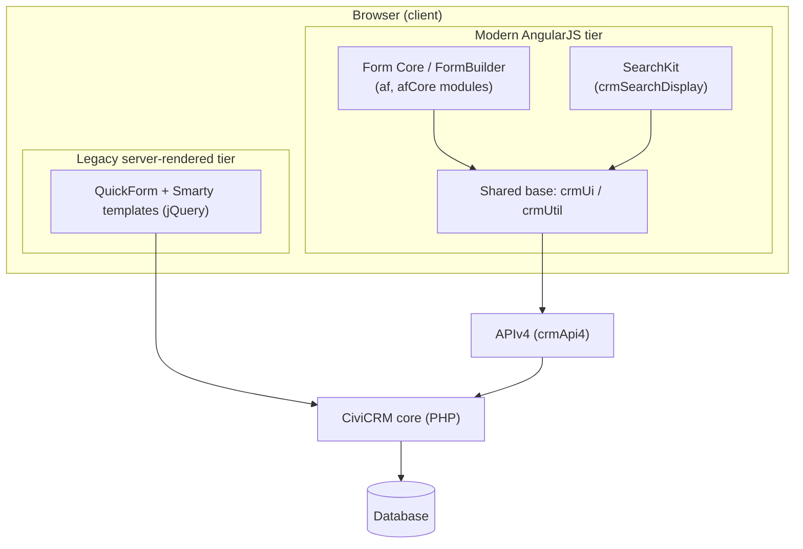
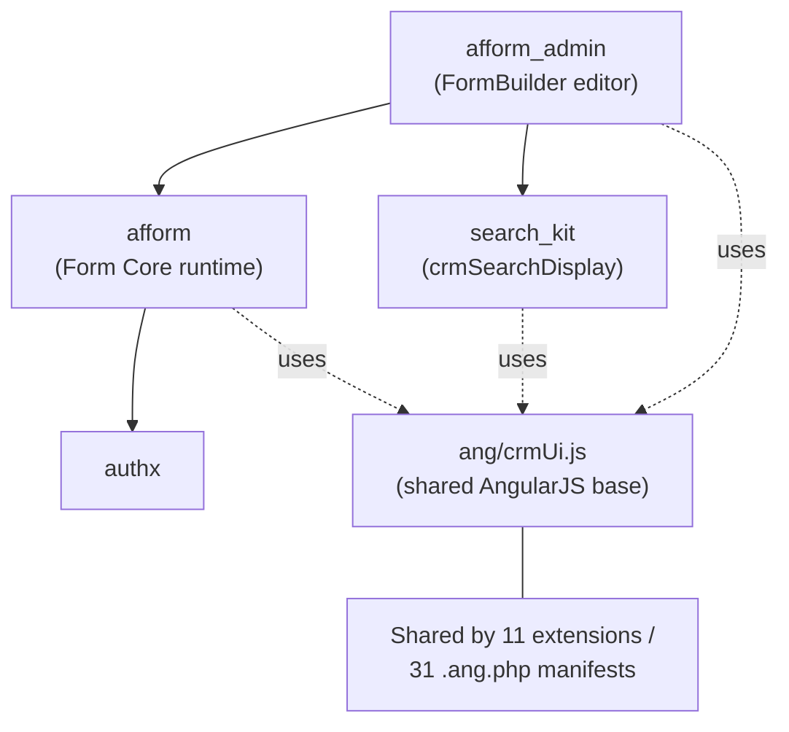
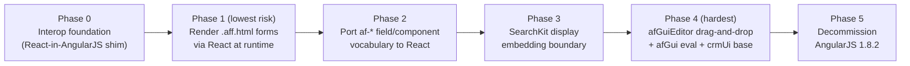

# FormBuilder (Afform): Current State & React Migration Assessment

This document quantifies the AngularJS user-interface surface of CiviCRM's FormBuilder (Afform) form-rendering stack and assesses the complexity of migrating that UI off end-of-life AngularJS 1.x to React. It documents the code **as it exists today** at CiviCRM core **6.17.alpha1**, under a strict minimal-change clause — no source behavior, interface, or configuration is altered. `Source: Technical Specification §3.2.2` It is organized in two parts: **Part A — Current State** (a measured inventory of the AngularJS surface) and **Part B — React Migration Complexity** (per-area complexity, the lowest-risk first slice, the hardest components, and a phased sequence).

## Table of Contents

- [Part A — Current State](#part-a--current-state)
  - [Scope & Method](#scope--method)
  - [Quantified AngularJS Surface](#quantified-angularjs-surface)
  - [Declarative, Framework-Agnostic Markup](#declarative-framework-agnostic-markup)
  - [APIv4 Boundary](#apiv4-boundary)
  - [Architecture](#architecture)
  - [Dependency & Blast Radius](#dependency--blast-radius)
- [Part B — React Migration Complexity](#part-b--react-migration-complexity)
  - [Complexity by Area](#complexity-by-area)
  - [Lowest-Risk First Slice](#lowest-risk-first-slice)
  - [Hardest Components](#hardest-components)
  - [Phased Sequence](#phased-sequence)
  - [Risks & Interop Strategy](#risks--interop-strategy)
  - [Versions Referenced](#versions-referenced)
  - [Research Note (Honesty)](#research-note-honesty)
- [Related Documentation](#related-documentation)

## Part A — Current State

This part inventories the AngularJS UI surface of the Afform stack, scoped to the stack and measured directly against source at the analyzed commit. `Source: ext/afform`

### Scope & Method

The counts in this document are **scoped to the Afform stack** — the Form Core runtime (`ext/afform/core`), the FormBuilder editor (`ext/afform/admin`), the SearchKit display surface where it backs forms (`ext/search_kit`), and the shared AngularJS base (`ang/crmUi.js`) — and were measured directly against source at the analyzed commit. They are deliberately narrower than repository-wide totals: for example, `.aff.html` form definitions number **124 repository-wide** but only **36 within `ext/afform`**. `Source: ext/afform` Every figure below cites the path from which it was measured, so the inventory stays traceable and reproducible.

### Quantified AngularJS Surface

The table below is the quantitative backbone of this assessment. Each area's metrics are measured from its `ang/` source tree.

| Metric | Core (`af`, `afCore`, `afformStandalone`) | Admin (`afAdmin`, `afGuiEditor`) | Shared base + SearchKit boundary |
|--------|-------------------------------------------|----------------------------------|----------------------------------|
| AngularJS module declarations | 3 | 2 | — |
| Components (`.component()`) | 7 | 23 | SearchKit: 48 |
| Directives (`.directive()`) | 11 | 3 | — |
| Controllers (`.controller()`) | 3 | 4 | — |
| Services (`.service()`) | 1 | 1 (`afGui`) | — |
| Filters (`.filter()`) | 8 | 10 | — |
| `$scope` references | 146 (17 JS files) | 304 (29 JS files) | SearchKit: 232 |
| `.aff.html` block definitions | 11 | 2 | repo-wide / within-afform: 124 / 36 |
| Non-`.aff.html` HTML templates | 25 | 64 | — |
| JS files | 21 | 31 | SearchKit: 72 |
| `crmApi4` client calls | 21 | 18 | — |
| Drag-and-drop references | — | ~25 `ui-sortable` / ~27 `draggable` | — |
| Shared base size | — | — | `ang/crmUi.js`: 1,372 lines |
| `crmUi` reach | — | — | ~11 extensions / ~31 `.ang.php` manifests |

`Source: ext/afform/core/ang` (Core), `Source: ext/afform/admin/ang` (Admin), `Source: ext/search_kit/ang` (SearchKit), `Source: ang/crmUi.js` and `Source: ext/` (shared base reach), `Source: ext/afform` (`.aff.html` totals). Module-declaration evidence: `Source: ext/afform/core/ang/af.js:L3`, `Source: ext/afform/admin/ang/afGuiEditor.js:L4`.

> The drag-and-drop figures (~25 / ~27) are approximate descriptive reference counts, not exact construct measurements. `Source: ext/afform/admin/ang`

### Declarative, Framework-Agnostic Markup

The single most important fact for migration risk is that `.aff.html` form markup is **declarative and framework-agnostic** — an `af-*` element/attribute vocabulary — rather than imperative AngularJS code. The developer documentation states that "Afform is a subset of AngularJS ... emphasizes the use of *directives* ... to *choose and arrange* the parts of your form." `Source: ext/afform/docs/angular.md:L3` Reinforcing this, every afform is itself an AngularJS directive and therefore a reusable sub-form. `Source: ext/afform/docs/embed.md:L8` Because the markup describes *what* a form contains rather than *how* AngularJS renders it, the form definitions themselves carry little framework-specific logic.

### APIv4 Boundary

The server-side form lifecycle is exposed through the `Afform` APIv4 entity, whose name expands to "The Affable Administrative Angular Form Framework." `Source: ext/afform/core/Civi/Api4/Afform.php:L12` The entity groups its actions into **Managing** forms (`create`, `get`, `save`, `update`, `revert`) and **Using** forms (`prefill`, `submit`, `submitFile`, `submitDraft`, `process`). `Source: ext/afform/core/Civi/Api4/Afform.php:L14-L19` The runtime lifecycle a rendered form traverses is **Get → Prefill → Process → Submit → Save**. `Source: ext/afform/core/Civi/Api4/Afform.php` On the client, the form definition and entity values are read and written through the `crmApi4` client (for example `Afform.prefill` then `Afform.submit`), and the collected values live in the in-memory model bound to `$scope`. `Source: ext/afform/core/ang/af/afForm.component.js`

By default an afform exposes a `$scope` with three variables: `routeParams` (a reference to the `$routeParams` service), `meta` (an object containing the form name), and `ts` (a string-translation helper used as `{{ts('Hello world')}}`). `Source: ext/afform/docs/writing.md:L6-L12`

### Architecture

Afform's modern AngularJS tier (`af`/`afCore`) and SearchKit (`crmSearchDisplay`) both sit on the shared `crmUi` base and reach the server through APIv4, whereas the legacy server-rendered tier (QuickForm + Smarty templates with jQuery) renders directly from CiviCRM core PHP. Both tiers ultimately read and write the same database through CiviCRM core, which is why a UI migration can target the modern tier without disturbing the legacy one.

*Diagram D1 — dual-generation UI architecture: the modern AngularJS tier (`af`/`afCore`) and SearchKit both sit on the shared `crmUi` base atop APIv4. `Source: ang/crmUi.js`, `Source: ext/afform/core/ang/af.js:L3`*

### Dependency & Blast Radius

The editor's dependency chain is explicit: `org.civicrm.afform_admin` requires **both** the core runtime (`org.civicrm.afform`) **and** SearchKit (`org.civicrm.search_kit`). `Source: ext/afform/admin/info.xml:L32-L35` All three tiers depend on the shared `ang/crmUi.js` base, whose reach is wide — referenced by ~11 extensions and declared as a dependency by ~31 `.ang.php` manifests — so any change to it ripples across the codebase. `Source: ext/`

*Diagram D4 — dependency / `crmUi` blast radius: the editor requires both core and SearchKit `Source: ext/afform/admin/info.xml:L32-L35`; all three depend on the shared `crmUi` base. `Source: ext/`*

## Part B — React Migration Complexity

This part rates React-migration complexity per area and sequences the work lowest-risk-first, anchored by the declarative nature of `.aff.html` markup. `Source: ext/afform/docs/angular.md:L3`

### Complexity by Area

Every in-scope area receives a complexity rating; none is left unrated.

| Area | Complexity | Reason (cite) |
|------|------------|---------------|
| Declarative `.aff.html` markup | **Low** | Framework-agnostic `af-*` vocabulary, not imperative AngularJS. `Source: ext/afform/docs/angular.md:L3` |
| Core runtime (`af`/`afCore`) | **Medium** | Declarative surface limits blast radius, but 146 `$scope` references and APIv4 binding must be ported. `Source: ext/afform/core/ang` |
| SearchKit-embedding boundary | **Medium–High** | 48 components / 232 `$scope` references embedded where forms host search displays. `Source: ext/search_kit/ang` |
| Shared `crmUi` base | **High** | 1,372 lines used across ~11 extensions / ~31 manifests. `Source: ang/crmUi.js`, `Source: ext/` |
| Admin editor (`afGuiEditor`) | **Very High** | 304 `$scope` references; jQuery-UI `ui-sortable` drag-and-drop bridged via `$timeout`/`$scope.$apply`; `afGui` runtime `$parse` string-eval. `Source: ext/afform/admin/ang/afGuiEditor.js:L461-L482`, `Source: ext/afform/admin/ang/afGuiEditor.js:L9-L11` |

### Lowest-Risk First Slice

The lowest-risk first slice is **rendering existing `.aff.html` forms via React at runtime**. Because the markup is declarative and framework-agnostic rather than imperative AngularJS, a React renderer can interpret the same `af-*` vocabulary without rewriting form definitions. `Source: ext/afform/docs/angular.md:L3` This delivers a visible, end-to-end migration proof on the most numerous and least framework-coupled artifact — the forms themselves — while leaving the editor and the shared base untouched. It also keeps the APIv4 boundary unchanged, since data still flows through `crmApi4`. `Source: ext/afform/core/ang/af/afForm.component.js`

### Hardest Components

The hardest target is the **`afGuiEditor`** editor. It bridges jQuery-UI `ui-sortable` drag-and-drop into Angular through `$timeout` + `$scope.$apply` `Source: ext/afform/admin/ang/afGuiEditor.js:L461-L482`, and its `afGui` service performs runtime string evaluation of markup attributes via `$parse`, gated only by a `doNotEval = ['filters']` allow-list. `Source: ext/afform/admin/ang/afGuiEditor.js:L9-L11` Compounding this is the shared **`crmUi` base** (1,372 lines) used across ~17 core extensions / 31 `.ang.php` manifests, so the editor cannot be migrated in isolation from the base it shares with the rest of the AngularJS estate. `Source: ang/crmUi.js`, `Source: ext/`

### Phased Sequence

A phased, screen-by-screen sequence isolates risk: establish interop first, migrate the declarative forms (lowest risk) `Source: ext/afform/docs/angular.md:L3`, then progressively tackle the `af-*` field vocabulary and the SearchKit boundary `Source: ext/search_kit/ang`, and finally the editor (hardest) `Source: ext/afform/admin/ang/afGuiEditor.js:L461-L482`, before decommissioning AngularJS 1.8.2. `Source: Technical Specification §3.2.2`

*Diagram D5 — React migration phasing roadmap. Phase 1 is the lowest-risk slice (declarative forms); Phase 4 is the hardest (editor + `afGui` eval + shared base). Derived from the Part A analysis.*

### Risks & Interop Strategy

The recommended approach is incremental — a "strangler-fig" / parallel-runtime strategy in which React components are mounted inside the existing AngularJS application through interop shims, allowing the UI to be migrated screen-by-screen rather than through a big-bang rewrite. The principal risks are:

- **AngularJS 1.8.2 is end-of-life** (since January 2022), so the framework receives no security or compatibility fixes — the central driver for migrating at all. `Source: Technical Specification §3.2.2`
- **`angular-ui-sortable` 0.19.0** underpins the editor's drag-and-drop and has no direct React equivalent; its behavior must be reproduced with a React drag-and-drop library. `Source: Technical Specification §3.2.2`
- **`crmUi` blast radius** — because the shared base is used across ~11 extensions / ~31 manifests, interop shims must keep AngularJS and React cooperating until the base itself is ported. `Source: ext/`

### Versions Referenced

- AngularJS **1.8.2** — end-of-life since January 2022. `Source: Technical Specification §3.2.2`
- `angular-ui-sortable` **0.19.0** — the editor's drag-and-drop dependency. `Source: Technical Specification §3.2.2`
- Monaco editor **0.49.0** — the Afform code editor. `Source: Technical Specification §3.2.2`
- CiviCRM core **6.17.alpha1** — the analyzed product version. `Source: Technical Specification §3.2.2`

### Research Note (Honesty)

Live web search returned no external results in this environment, so the migration-pattern guidance in this assessment reflects established, widely-practiced incremental-migration engineering rather than a specific cited source. No external URLs or citations are fabricated. If live web access is available, the author should cite the official AngularJS lifecycle/end-of-life announcement and a reputable incremental-migration reference (for example, an authoritative description of the "strangler-fig" parallel-runtime pattern) directly in this section. `Source: Technical Specification §3.2.2`

## Related Documentation

- [Form Core (afform) runtime README](../../ext/afform/core/README.md)
- [FormBuilder editor (afform_admin) README](../../ext/afform/admin/README.md)
- [Full AngularJS Integration](../../ext/afform/docs/angular.md)
- [Writing Forms](../../ext/afform/docs/writing.md)
- [Embedding Forms](../../ext/afform/docs/embed.md)
- [Form CRUD](../../ext/afform/docs/crud.md)
- [Quick Start](../../ext/afform/docs/quickstart.md)
