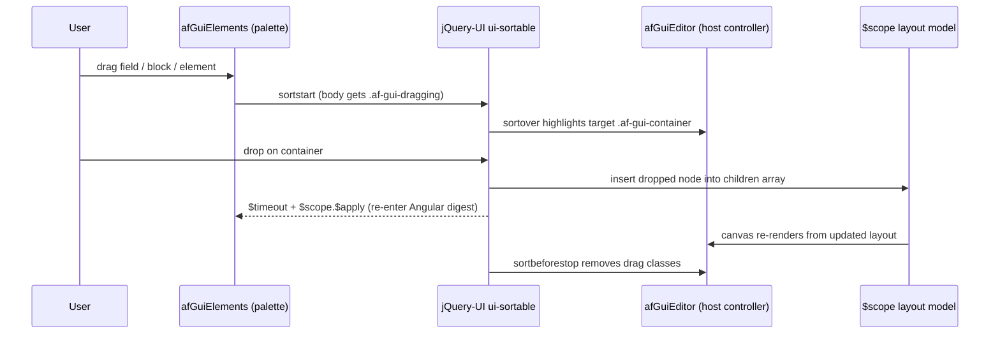
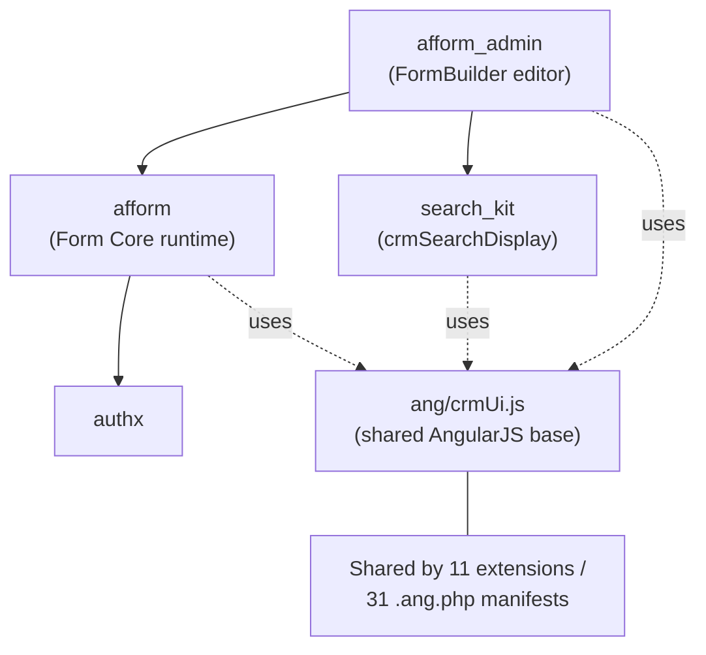

# FormBuilder (afform_admin)

**FormBuilder** (extension key `org.civicrm.afform_admin`) is the visual editor for CiviCRM's Afform forms. Its manifest names it "FormBuilder" and describes it as a tool to "Administer, edit and compose dynamic forms". `Source: ext/afform/admin/info.xml:L2-L5` The extension is licensed under [AGPL-3.0](LICENSE.txt). `Source: ext/afform/admin/info.xml:L6`

FormBuilder is the AngularJS editor (`afGuiEditor`) that lets administrators build and modify `.aff.html` form definitions through a drag-and-drop canvas, rather than by hand-authoring markup. It:

- Visually builds and edits `.aff.html` forms by dragging fields, blocks, and elements from a palette onto canvas containers. `Source: ext/afform/admin/ang/afGuiEditor.js:L468-L490`
- Configures entities, fields, blocks, search displays, and display conditions through its `afGui*` components. `Source: ext/afform/admin/ang`
- Reads and writes form definitions through the `Afform` APIv4 entity via the `crmApi4` client. `Source: ext/afform/admin/ang/afGuiEditor/afGuiEditor.component.js:L296`
- Is an optional admin tool and is not required for the forms themselves to function. `Source: ext/afform/admin/info.xml:L31`

## Table of Contents

- [Requirements](#requirements)
- [Installation (CLI, Git)](#installation-cli-git)
- [Overview & Purpose](#overview--purpose)
- [Component Map & Relationships](#component-map--relationships)
- [The `afGui` Service](#the-afgui-service)
- [Drag-and-Drop Editing Flow](#drag-and-drop-editing-flow)
- [Reading & Writing `.aff.html`](#reading--writing-affhtml)
- [Dependencies](#dependencies)
- [Known Limitations](#known-limitations)
- [Developer Documentation](#developer-documentation)

## Requirements

* PHP 8.0 – 8.4. `Source: ext/afform/admin/info.xml:L21-L27`
* CiviCRM core (the extension version and compatibility track the CiviCRM core version). `Source: ext/afform/admin/info.xml:L16-L19`
* The `org.civicrm.afform` (Form Core) and `org.civicrm.search_kit` extensions, which are hard dependencies (see [Dependencies](#dependencies)). `Source: ext/afform/admin/info.xml:L32-L35`

> Version note: the previous civix-generated stub listed a long-obsolete PHP version. The live `info.xml` manifest declares PHP 8.0–8.4, which is authoritative. `Source: ext/afform/admin/info.xml:L21-L27`

## Installation (CLI, Git)

Sysadmins and developers may enable FormBuilder via the UI extensions page or with the command-line tool [cv](https://github.com/civicrm/cv). The extension's `<file>` handle is `afform_admin`. `Source: ext/afform/admin/info.xml:L3`

```bash
cv en afform_admin
```

`Source: ext/afform/admin/info.xml:L3`

## Overview & Purpose

FormBuilder is registered under the key `org.civicrm.afform_admin` with the product name "FormBuilder" and the purpose "Administer, edit and compose dynamic forms". `Source: ext/afform/admin/info.xml:L2-L5`

It is an *optional* administrative tool: the manifest states it "provides a UI to administer and edit forms" and is "not required for the forms to function". Forms are rendered and processed by the separate Form Core runtime even when this editor is disabled. `Source: ext/afform/admin/info.xml:L31`

The editor itself is the AngularJS module `afGuiEditor`, declared via CiviCRM's `CRM.angRequires()` convention. `Source: ext/afform/admin/ang/afGuiEditor.js:L4`

## Component Map & Relationships

The editor is organized around a single host component, `afGuiEditor`, which is the editor shell and top-level controller. `Source: ext/afform/admin/ang/afGuiEditor/afGuiEditor.component.js` The host renders the canvas and palette and contains a tree of child components that represent the editable parts of a form.

| Component | Role |
|-----------|------|
| `afGuiEditor` | Host shell and top-level controller. `Source: ext/afform/admin/ang/afGuiEditor/afGuiEditor.component.js` |
| `afGuiContainer` | A layout container (fieldset / block) that holds child elements. `Source: ext/afform/admin/ang/afGuiEditor/elements/afGuiContainer.component.js` |
| `afGuiEntity` | Binds a container to a CiviCRM entity. `Source: ext/afform/admin/ang/afGuiEditor/afGuiEntity.component.js` |
| `afGuiField` | A single form field control. `Source: ext/afform/admin/ang/afGuiEditor/elements/afGuiField.component.js` |
| `afGuiText` / `afGuiMarkup` | Static text and rich-markup elements. `Source: ext/afform/admin/ang/afGuiEditor/elements/afGuiText.component.js` `Source: ext/afform/admin/ang/afGuiEditor/elements/afGuiMarkup.component.js` |
| `afGuiButton` | A submit/action button element. `Source: ext/afform/admin/ang/afGuiEditor/elements/afGuiButton.component.js` |
| `afGuiTabset` | Groups containers into tabs. `Source: ext/afform/admin/ang/afGuiEditor/elements/afGuiTabset.component.js` |
| `afGuiSearch` / `afGuiSearchDisplay` | Embeds a SearchKit display into a form. `Source: ext/afform/admin/ang/afGuiEditor/afGuiSearch.component.js` `Source: ext/afform/admin/ang/afGuiEditor/elements/afGuiSearchDisplay.component.js` |
| `afGuiClause` / `afGuiCondition` | Build the filter clauses and display conditions. `Source: ext/afform/admin/ang/afGuiEditor/afGuiClause.component.js` `Source: ext/afform/admin/ang/afGuiEditor/afGuiCondition.component.js` |
| `afGuiElements` | The palette of draggable fields, blocks, and elements. `Source: ext/afform/admin/ang/afGuiEditor/afGuiElements.component.js` |
| `afGuiMenuItemStyle` / `Background` / `Border` / `Collapsible` | Menu-item style controls for containers. `Source: ext/afform/admin/ang/afGuiEditor/afGuiMenuItemStyle.component.js` `Source: ext/afform/admin/ang/afGuiEditor/afGuiMenuItemBackground.component.js` `Source: ext/afform/admin/ang/afGuiEditor/afGuiMenuItemBorder.component.js` `Source: ext/afform/admin/ang/afGuiEditor/afGuiMenuItemCollapsible.component.js` |
| `afGuiContainerMultiToggle` / `afGuiEditOptions` | Container multi-select toggle and edit-option controls. `Source: ext/afform/admin/ang/afGuiEditor/afGuiContainerMultiToggle.component.js` `Source: ext/afform/admin/ang/afGuiEditor/afGuiEditOptions.component.js` |

In total the extension defines **23 AngularJS components** across its `ang/` tree (modules `afAdmin` and `afGuiEditor`). `Source: ext/afform/admin/ang`

The components are tied together by the `afGui` service, which holds the shared form metadata and evaluates the markup-to-model bindings the components read and write. `Source: ext/afform/admin/ang/afGuiEditor.js:L6`

## The `afGui` Service

`afGui` is the editor's metadata and DOM-model layer. It is declared as an AngularJS service that injects `crmApi4`, `$parse`, and `$q`. `Source: ext/afform/admin/ang/afGuiEditor.js:L6` The service ingests and clears form metadata, looks up entities, fields, and search displays, recursively walks the form-definition tree, and (de)serializes classes, styles, and filters.

A central responsibility is *runtime string evaluation*. The PHP side produces form metadata in which some attribute strings are JavaScript expressions that PHP could not evaluate. The `afGui` service walks each node's `#children`, and for every string property whose key is **not** in the `doNotEval` allow-list and that `looksLikeJs()`, it evaluates the string through Angular's `$parse` with a `ts` translation helper. `Source: ext/afform/admin/ang/afGuiEditor.js:L15-L31`

The allow-list of keys that are skipped (never evaluated) is a single entry, `filters`:

```js
      const doNotEval = ['filters'];
```

`Source: ext/afform/admin/ang/afGuiEditor.js:L13`

The `looksLikeJs()` heuristic gate decides which strings are worth evaluating: object literals (`{…}`), array literals (`[…]`), or a `ts(` translation call. `Source: ext/afform/admin/ang/afGuiEditor.js:L34-L41` This runtime evaluation of attribute strings into values is one of the hardest pieces to reproduce outside AngularJS, because it relies on the `$parse` expression engine.

## Drag-and-Drop Editing Flow

Editing happens on a canvas driven by drag-and-drop. The user drags fields, blocks, or elements from the palette (`afGuiElements`) onto canvas containers. `Source: ext/afform/admin/ang/afGuiEditor/afGuiElements.component.js` The drag itself is managed by jQuery-UI's `ui-sortable`. Global, document-level handlers toggle CSS classes during the drag: `af-gui-dragging` is added to `body` on `sortstart`, and `af-gui-dragtarget` is added to the hovered `.af-gui-container` on `sortover` (and removed on `sortout` / `sortbeforestop`). `Source: ext/afform/admin/ang/afGuiEditor.js:L468-L490`

Because the drop is handled by jQuery-UI *outside* the Angular digest, the rebuilt palette lists must be pushed back into Angular explicitly, via `$timeout` followed by `$scope.$apply`. `Source: ext/afform/admin/ang/afGuiEditor/afGuiElements.component.js:L104-L113`



*Diagram D3: drag-and-drop editing flow; on drop, the node is inserted into the layout model's `#children` array. `Source: ext/afform/admin/ang/afGuiEditor.js:L468-L490`; digest re-entry at `Source: ext/afform/admin/ang/afGuiEditor/afGuiElements.component.js:L104-L113`.*

## Reading & Writing `.aff.html`

The editor loads a form's definition together with its supporting metadata through the `Afform` APIv4 entity, and persists edits back through the same entity. All of these calls go through the `crmApi4` client that the `afGui` service injects. `Source: ext/afform/admin/ang/afGuiEditor.js:L6`

- **Load:** `Afform.loadAdminData` returns the form definition plus the entity/field/search metadata the editor needs. `Source: ext/afform/admin/ang/afGuiEditor/afGuiEditor.component.js:L296` (the `afGui` service then processes those results — `Source: ext/afform/admin/ang/afGuiEditor.js:L160`). Server-side, `loadAdminData` reads each form's definition through the `Afform.get` API: its private `loadForm()` helper calls `Afform::get(...)`, so `Afform.get` is the underlying read path the editor relies on. `Source: ext/afform/admin/Civi/Api4/Action/Afform/LoadAdminData.php:L264-L265`
- **Supporting lookups:** saved-search options for embeddable displays are fetched with `crmApi4('SavedSearch', 'get', …)`. `Source: ext/afform/admin/ang/afGuiEditor.js:L221`
- **Save:** edits are written with `Afform.save`. `Source: ext/afform/admin/ang/afGuiEditor/afGuiEditor.component.js:L728`

Under the hood there is a round trip between markup and model. PHP-side `.aff.html` markup is parsed into a JSON layout model — the `#tag` / `#children` tree that the `afGui` service evaluates — which is edited in the browser and then serialized back to `.aff.html` (and `.aff.json`) on save. The editor can also ask the API to convert between the deep layout model and HTML via `Afform.convert`. `Source: ext/afform/admin/ang/afGuiEditor/afGuiEditor.component.js:L229` For the server-side form lifecycle (`Get`, `Prefill`, `Process`, `Submit`, `Save`), see the sibling [Form Core (afform) runtime](../core/README.md) README.

## Dependencies

FormBuilder requires **both** the core form runtime and SearchKit. Its manifest declares hard dependencies on `org.civicrm.afform` (so forms can be rendered and saved) and `org.civicrm.search_kit` (so forms can embed search displays). `Source: ext/afform/admin/info.xml:L32-L35`

The editor UI is also built on the shared AngularJS base `ang/crmUi.js`, the same `crmUi` helper layer used widely across CiviCRM extensions. `Source: ang/crmUi.js` That shared base is the principal "blast-radius" factor for any framework migration: it is referenced by roughly 11 extensions and declared as a dependency by roughly 31 `.ang.php` module manifests. `Source: ext/` (counts per the current-state analysis; see [Developer Documentation](#developer-documentation)).



*Diagram D4: dependency and `crmUi` blast-radius graph. Requires edges from `Source: ext/afform/admin/info.xml:L32-L35`; blast-radius counts from `Source: ext/`.*

Because the editor sits on top of the core runtime and SearchKit, and all three share the `crmUi` base, FormBuilder has the widest dependency surface of the three modules. The sibling [Form Core (afform) runtime](../core/README.md) README documents the runtime side of this chain.

## Known Limitations

- The editor is built on **AngularJS 1.8.2**, which has been **end-of-life since January 2022** with no further upstream releases expected. `Source: composer.json:L145-L146` `Source: Technical Specification §3.2.2`
- The drag-and-drop relies on **`angular-ui-sortable` 0.19.0**, an unmaintained AngularJS-era wrapper over jQuery-UI's sortable. `Source: composer.json:L167-L168` The editor's drag handlers build on it. `Source: ext/afform/admin/ang/afGuiEditor.js:L468-L490`
- The `afGui` service performs **runtime string evaluation** of markup attributes via `$parse` (gated by the `doNotEval` allow-list), which has no direct equivalent outside AngularJS. `Source: ext/afform/admin/ang/afGuiEditor.js:L13-L31`

## Developer Documentation

- [Form Core (afform) runtime](../core/README.md) — the sibling runtime that renders and processes the forms this editor builds.
- [FormBuilder (afform) overview](../README.md) — the parent extension overview.
- [Full AngularJS Integration](../docs/angular.md) — integrating between Afform and vanilla AngularJS.
- [Writing Forms](../docs/writing.md) — Afform as basic AngularJS templates.
- [Embedding Forms](../docs/embed.md) — Afform as a reusable building block.
- [Form CRUD](../docs/crud.md) — updating forms via the programmatic API.
