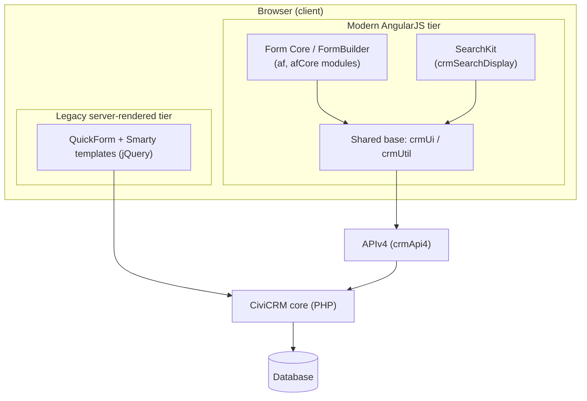
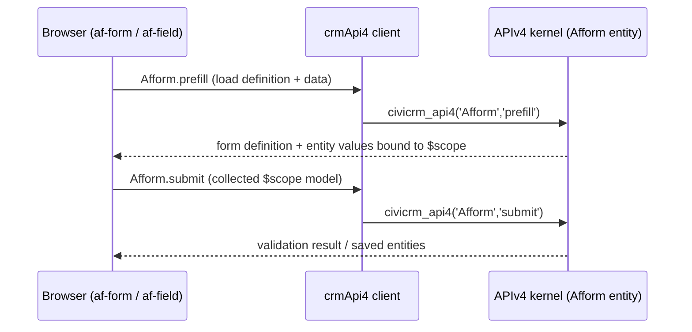

# Form Core (afform)

**Form Core** (extension key `org.civicrm.afform`) provides the "Core functionality for rendering and processing dynamic forms" in CiviCRM. `Source: ext/afform/core/info.xml:L2-L5` It is the declarative AngularJS runtime that turns `.aff.html` form definitions into live, data-bound forms and processes their submissions through APIv4. The extension is licensed under AGPL-3.0. `Source: ext/afform/core/info.xml:L6`

This module is the engine behind FormBuilder: it ships the reusable `af-*` element vocabulary, the form controllers that bind entity data onto `$scope`, and a Standalone bundle that loads the runtime.

- Declaratively renders AngularJS-based forms from `.aff.html` definitions using the `af-*` vocabulary. `Source: ext/afform/core/ang/af.ang.php:L13-L21`
- Reads and writes entity data through the `Afform` APIv4 entity via `crmApi4` (`prefill` / `submit`). `Source: ext/afform/core/ang/af/afForm.component.js:L117`
- Provides the reusable `af-*` directive vocabulary shared across Afform-based screens. `Source: ext/afform/core/ang/af.ang.php:L13-L21`
- Registers an `afformStandalone` bundle that loads all available runtime modules. `Source: ext/afform/core/ang/afformStandalone.js:L3`

## Table of Contents

- [Requirements](#requirements)
- [Installation (CLI, Git)](#installation-cli-git)
- [Overview & Purpose](#overview--purpose)
- [Architecture Fit](#architecture-fit)
- [Key Modules](#key-modules)
- [Declarative Components & Directives](#declarative-components--directives)
- [How a `.aff.html` Form Loads & Renders](#how-a-affhtml-form-loads--renders)
- [APIv4 Data Access](#apiv4-data-access)
- [$scope & Data-Binding Patterns](#scope--data-binding-patterns)
- [Dependencies](#dependencies)
- [Known Limitations](#known-limitations)
- [Developer Documentation](#developer-documentation)

## Requirements

* PHP 8.0 – 8.4. `Source: ext/afform/core/info.xml:L20-L26`
* CiviCRM core (the extension version and compatibility track the CiviCRM core version). `Source: ext/afform/core/info.xml:L16-L18`
* The `authx` extension, which is a hard dependency (see [Dependencies](#dependencies)). `Source: ext/afform/core/info.xml:L43-L45`

> Version note: the parent `ext/afform/README.md` still lists an older PHP requirement that is now stale. The live `info.xml` manifest declares PHP 8.0–8.4, which is authoritative. `Source: ext/afform/core/info.xml:L20-L26`

## Installation (CLI, Git)

Sysadmins and developers may enable Form Core via the UI extensions page or with the command-line tool [cv](https://github.com/civicrm/cv). The extension's `<file>` handle is `afform`. `Source: ext/afform/core/info.xml:L3`

```bash
cv en afform
```

`Source: ext/afform/core/info.xml:L3`

## Overview & Purpose

Form Core declares the extension key `org.civicrm.afform`, the product name "Form Core", and the description "Core functionality for rendering and processing dynamic forms". `Source: ext/afform/core/info.xml:L2-L5`

The name expands as documented in the APIv4 entity: "Afform stands for *The Affable Administrative Angular Form Framework*." `Source: ext/afform/core/Civi/Api4/Afform.php:L12`

In the project's own developer docs, Afform is framed as "a subset of AngularJS -- it emphasizes the use of *directives* as a way to *choose and arrange* the parts of" a form. `Source: ext/afform/docs/angular.md:L3` In practice, a form author works with declarative *blocks* and *directives* rather than imperative controller code. This declarative, framework-agnostic style means a form definition describes *what* to render rather than encoding imperative AngularJS logic.

## Architecture Fit

Form Core is the **modern AngularJS tier** of CiviCRM's dual-generation user interface. CiviCRM renders screens in two ways: a modern AngularJS single-page-application tier (Afform, SearchKit, and friends) layered on a shared UI base, and a legacy server-rendered QuickForm/Smarty tier. The Afform tier is built on the shared `ang/crmUi.js` UI-helper base and is backed by APIv4. `Source: ang/crmUi.js` `Source: ext/afform/core/ang/af.ang.php:L11`



*Diagram D1 — the dual-generation UI architecture. The `af` and `afCore` modules form the Afform tier and depend on the shared `crmUi` / `crmUtil` base. `Source: ext/afform/core/ang/af.ang.php` `Source: ang/crmUi.js`*

## Key Modules

Form Core declares **three** AngularJS modules: `af`, `afCore`, and `afformStandalone`. `Source: ext/afform/core/ang` Module declarations live directly under `ang/` (for example `ang/af.js` and `ang/afCore.js`); the matching `ang/af/` and `ang/afCore/` subfolders hold the component, directive, and element *implementations* rather than the module declarations themselves.

- **`af`** — the declarative form-vocabulary module, declared with `angular.module('af', CRM.angRequires('af'));`. `Source: ext/afform/core/ang/af.js:L3` Its `.ang.php` manifest autoloads `ang/af/*.js`, declares a `crmUtil` dependency, and exports the directives `af-entity`, `af-fieldset`, `af-form`, `af-join`, `af-repeat`, `af-repeat-item`, and `af-field`. `Source: ext/afform/core/ang/af.ang.php:L13-L21`
- **`afCore`** — the shared runtime / API-binding module, declared in `ang/afCore.js` with `angular.module('afCore', CRM.angRequires('afCore'));`. `Source: ext/afform/core/ang/afCore.js:L3` It carries a richer dependency surface, requiring `crmUi`, `crmUtil`, `api4`, and `ngSanitize` among others. `Source: ext/afform/core/ang/afCore.ang.php:L10`
- **`afformStandalone`** — a minimal bundle that loads all available modules and registers an `AfformStandalonePageCtrl` controller. `Source: ext/afform/core/ang/afformStandalone.js:L3-L5`

## Declarative Components & Directives

The `af` surface comprises **7 components** and **11 directives**. `Source: ext/afform/core/ang` The public declarative vocabulary — the `af-*` elements and attributes a form author composes — is summarised below.

| Element | Type | Source | Purpose |
|---------|------|--------|---------|
| `afForm` | component | `ext/afform/core/ang/af/afForm.component.js` | Root form container; owns the data model and submit path |
| `afField` | component | `ext/afform/core/ang/af/afField.component.js` | Renders a single field control bound to an entity field |
| `afFieldset` | directive | `ext/afform/core/ang/af/afFieldset.directive.js` | Groups fields for one entity and provides the fieldset scope |
| `afEntity` | component | `ext/afform/core/ang/af/afEntity.component.js` | Declares an entity the form reads and writes |
| `afRepeat` / `afRepeatItem` | directive | `ext/afform/core/ang/af/afRepeat.directive.js` | Repeating block for multiple records (add / remove items) |
| `afIf` | directive | `ext/afform/core/ang/af/afIf.directive.js` | Conditionally shows or hides part of the form |
| `afJoin` | directive | `ext/afform/core/ang/af/afJoin.directive.js` | Manages joined / related-entity data |
| `afTab` / `afTabset` | directive / component | `ext/afform/core/ang/af/afTabset.component.js` | Tabbed layout for grouping form sections |
| `afButton` | directive | `ext/afform/core/ang/af/afButton.directive.js` | Submit / action button |
| `afTitle` | directive | `ext/afform/core/ang/af/afTitle.directive.js` | Form title element |
| `afMarkup` | custom element | `ext/afform/core/ang/af/afMarkup.element.js` | Renders arbitrary (token-aware) markup inside a form |
| `afToken` | custom element | `ext/afform/core/ang/af/afToken.element.js` | Renders token content within a form |

The **rendering entry points** are `afForm.component.js` and `afField.component.js`, both under `ext/afform/core/ang/af/`. `Source: ext/afform/core/ang/af/afForm.component.js` `Source: ext/afform/core/ang/af/afField.component.js` Note that `afMarkup` and `afToken` are implemented as native custom elements (each extends `HTMLElement`) rather than AngularJS directives. `Source: ext/afform/core/ang/af/afMarkup.element.js` `Source: ext/afform/core/ang/af/afToken.element.js`

A `.aff.html` block definition is plain, declarative markup — an `af-container` wrapper holding `af-field` elements:

```html
<div class="af-container af-layout-inline">
  <af-field name="email" />
```

`Source: ext/afform/core/ang/afblockContactEmail.aff.html:L1-L2`

There are **11** such `.aff.html` block definitions shipped under `ang/`. `Source: ext/afform/core/ang`

## How a `.aff.html` Form Loads & Renders

A `.aff.html` form is declarative markup of `af-form` / `af-field` (and related) elements. When the browser renders the markup, the `afForm` controller initialises and calls `Afform.prefill` through the `crmApi4` client to load the form definition together with any existing entity values; those values are bound onto `$scope`. On submission, the collected `$scope` model is sent back through `Afform.submit`. The server-side lifecycle is exposed by the `Afform` APIv4 entity. `Source: ext/afform/core/ang/af/afForm.component.js:L117` `Source: ext/afform/core/Civi/Api4/Afform.php:L14-L19`



*Diagram D2 — the `.aff.html` load → render → submit data flow.*

## APIv4 Data Access

The `Afform` APIv4 entity exposes two families of actions. `Source: ext/afform/core/Civi/Api4/Afform.php:L14-L19`

- **Managing forms** — `create`, `get`, `save`, `update`, and `revert` read and write the form HTML and JSON files. `Source: ext/afform/core/Civi/Api4/Afform.php:L15-L16`
- **Using forms** — `prefill`, `submit`, `submitFile`, `submitDraft`, and `process` prepare forms and process submissions. `Source: ext/afform/core/Civi/Api4/Afform.php:L17-L18`

The runtime lifecycle most relevant to rendering is the subset **Get → Prefill → Process → Submit → Save**.

On load, the form controller fetches the definition and data:

```js
          return crmApi4('Afform', 'prefill', params)
```

`Source: ext/afform/core/ang/af/afForm.component.js:L117`

On submission, it posts the collected model back:

```js
        const submitApi = crmApi4('Afform', 'submit', {
          name: ctrl.getFormMeta().name,
          args: args,
```

`Source: ext/afform/core/ang/af/afForm.component.js:L472-L474` (the full object also includes `values: data,` at L475).

## $scope & Data-Binding Patterns

By default, Afform creates a `$scope` exposing three variables: `routeParams` (a reference to the `$routeParams` service), `meta` (an object that for now contains the form name), and `ts` (the string-translation helper, used as `{{ts('Hello world')}}`). `Source: ext/afform/docs/writing.md:L6-L12`

The form-level `afForm` component has no template of its own; on init it makes its controller available by adding it to the parent scope, so child `af-field` / `af-fieldset` elements can reach the shared form model. `Source: ext/afform/core/ang/af/afForm.component.js:L34-L36`

```js
        // This component has no template. It makes its controller available within it by adding it to the parent scope.
        // Exposing it by name (this.ctrl) is how child directives/templates reach this form controller through $scope.
        $scope.$parent[this.ctrl] = this;
```

`Source: ext/afform/core/ang/af/afForm.component.js:L34-L36`

## Dependencies

- **Required extension — `authx`.** The manifest declares `<requires><ext>authx</ext></requires>`, so Form Core cannot be enabled without it. `Source: ext/afform/core/info.xml:L43-L45`
- **Shared AngularJS base — `crmUi` / `crmUtil`.** The `af` module requires `crmUtil`, and the broader Afform runtime builds on the shared `ang/crmUi.js` UI-helper base. `Source: ext/afform/core/ang/af.ang.php:L11` `Source: ang/crmUi.js`
- **SearchKit (boundary).** When a form embeds a search display (`crmSearchDisplay`), it depends on SearchKit. Form Core recognises the SearchKit display tags (including `crm-search-display`) when parsing a form. This is a boundary dependency used by embedding forms; it is not part of Form Core itself. `Source: ext/afform/core/Civi/Afform/Utils.php:L243-L246`

## Known Limitations

- The entire `af` / `afCore` tier is built on AngularJS — every module is registered through `angular.module(...)`. `Source: ext/afform/core/ang/af.js:L3`
- AngularJS 1.8.2 has been end-of-life since January 2022, and no further upstream releases are expected. `Source: composer.json:L145-L146` `Source: Technical Specification §3.2.2` For a quantified analysis of this AngularJS surface and the phased plan to migrate it to React, see [Current State & React Migration](../../../docs/dev/formbuilder-current-state-and-react-migration.md).

## Developer Documentation

- [Current State & React Migration](../../../docs/dev/formbuilder-current-state-and-react-migration.md) — quantified analysis of the AngularJS form surface and the phased React migration assessment.
- [Full AngularJS Integration](../docs/angular.md) — integrating between Afform and vanilla AngularJS.
- [Writing Forms](../docs/writing.md) — Afform as basic AngularJS templates.
- [Embedding Forms](../docs/embed.md) — Afform as a reusable building block.
- [Form CRUD](../docs/crud.md) — updating forms via the programmatic API.
- [Quick Start](../docs/quickstart.md) — creating the canonical definition of a basic form.
- [FormBuilder (afform) overview](../README.md) — the parent extension README.
