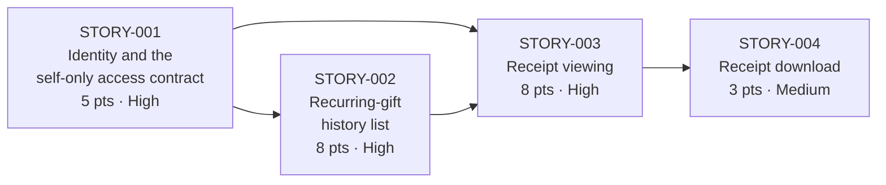

# Epic: Receipt & Contribution History Self-Service

- **Epic ID:** `EPIC-001`
- **Epic name (exact string):** `Receipt & Contribution History Self-Service`
- **Baseline codebase:** CiviCRM `6.17.alpha1` ([`xml/version.xml`:3])
- **Status:** drafted for Product / Engineering / QA sign-off, ahead of implementation

This document is the human-readable entry point to the backlog for one Epic. It carries the
Epic definition, the story roster and its dependency graph, the JIRA import reconciliation,
the closing `[NEEDS CLARIFICATION]` summary, the deferred-Epic note and the record of values
that were inferred rather than specified. The four stories themselves are separate documents;
the two machine-readable exports and the JIRA mapping file are separate again.

---

## 1. Epic definition

The Epic's boundary is fixed by the business sponsor in these words, reproduced verbatim.
Everything in this backlog derives from this sentence, and where the sentence is silent the
backlog raises a question rather than inventing an answer:

> A logged-in donor can view and download receipts for past contributions generated by their
> recurring gift(s), and nothing else's, without staff involvement. One-time, non-recurring
> donations are out of scope for this Epic; scope the list and receipt queries to contributions
> tied to a `contribution_recur_id` accordingly.

### 1.1 How that definition is read

Two readings are stated plainly here because getting either wrong is expensive downstream.

**"and nothing else's" excludes *another donor's* recurring gifts.** The possessive is about
ownership of the gift, not about the kind of gift. It is the tenant-isolation requirement, and
it is what makes the first three stories security-critical rather than merely functional.

**The recurring-only sentence scopes *the list and receipt queries this Epic introduces*.** The
sentence names its own target — "the list and receipt queries" — so the recurring-only boundary
becomes a server-side predicate on the new queries. It is **not** an instruction to withdraw
functionality a donor has today. The existing all-contributions pane on the donor route stays,
and one-time and non-recurring donation handling is unaffected. How the new recurring-only pane
and the existing all-contributions pane sit together on the same route is a presentation
question, raised as `CLR-04` and deliberately not answered here.

**Two verbs, therefore two capabilities.** "View" and "download" are separate, separately
valuable and separately testable, which is why the receipt stage of the mandated sequence
becomes two stories rather than one (see §4.2).

### 1.2 What this Epic does not change

Carried from the business objective's own exclusions, so a reviewer can confirm the blast radius
is what they expect:

- One-time and non-recurring donation handling is unaffected.
- There is no change to how staff process donations.
- There is no new payment-processor integration; the portal is specified against whatever
  processor the target instance already has configured.
- The existing staff receipt task continues to work exactly as it does today.

---

## 2. How to read this backlog

**This run produced specification artifacts only.** No CiviCRM code was written, no pull request
was opened, and no existing repository file was modified. Implementation is a separate exercise
that consumes these artifacts; the acceptance criteria in the stories are what that exercise is
verified against.

**No runtime was stood up for this run.** Every factual claim about the existing system is a
reading of source at a stated address, obtained by static inspection. No claim rests on observed
runtime behaviour — most importantly, the ownership gap described in §5 is a reading of an access
callback, not an exploit that was executed. Where a fact about the *target deployment* cannot be
read from source (which extensions are enabled, which roles exist, which settings are on), the
backlog raises a clarification instead of guessing.

**No user-specified rules govern this project.** The rules document for this project contains no
rules, so the work is held to enterprise-standard best practice and to the validation criteria the
originating technical specification sets for this run's output. No rule was invented to fill the
gap.

**Business context comes from the leadership business objective** supplied with the request. That
document is not part of this repository and is not cited as a repository path anywhere in these
artifacts.

**Section references of the form `0.x.y`** — which appear inside a few clarification flags —
point to the originating technical specification that produced this backlog, not to a section of
this document.

### 2.1 Artifact inventory

Eight files, all under `jira-stories/`, and nothing outside it:

| File | What it is |
|---|---|
| `epics.md` | this document — Epic-level and import-level content |
| `STORY-001-donor-identity-and-self-only-scoping.md` | STORY-001, all nine fields |
| `STORY-002-recurring-contribution-history-list.md` | STORY-002, all nine fields |
| `STORY-003-recurring-gift-receipt-viewing.md` | STORY-003, all nine fields |
| `STORY-004-recurring-gift-receipt-download.md` | STORY-004, all nine fields |
| `stories-export.csv` | the nine native columns, four data rows |
| `stories-export.json` | an array of four story objects, exactly the nine fields each |
| `jira-import-mapping.csv` | thirteen columns, Epic row first, then four story rows |

The nine fields carried by every story, in the mandated order, are: **Story ID, Title,
Description, Business Value, Acceptance Criteria, Technical Notes, Dependencies, Story Points,
Labels.** There is no Epic field among them — Epic-level content lives here and in the mapping
file, which is why this document exists as well as the exports.

---

## 3. Business context

Drawn from the leadership business objective supplied with this request, which is the source of
truth for every Business Value field in the four stories.

### 3.1 The pain today

- **Every request goes through a staff member**, who reads or edits the donor's record directly.
  There is no route by which a donor resolves anything themselves.
- **That costs the team several hours a week**, spread across the people who field the requests.
- **Donors are frustrated at being unable to do simple things themselves outside business
  hours.** The queue only moves when the office is open.
- **In the fourth quarter the volume overwhelms the team** — staff can no longer keep up with the
  requests coming in at the busiest giving time of the year.
- **A donor who wants a copy of a past receipt has to ask staff for it.** That specific request
  is the one this Epic removes from the queue.

The objective records one further pain point which is deliberately **not** used as business value
for this Epic: the cause it names is remediated by a different, deferred Epic, so this Epic
cannot honestly claim the effect. It is stated where it belongs, in §8.

### 3.2 The success criteria this Epic delivers against

- A donor can **view and download a receipt for any past contribution generated by their
  recurring gift(s) specifically**.
- The portal **only exposes a donor's own contribution history, never another donor's**.
- The self-service area is reachable **without calling or emailing staff**.

The objective states a fourth criterion — that every self-service action is logged and visible to
staff — which belongs to the staff-visibility and audit-trail Epic. It is **not** claimed by this
Epic and is carried forward intact in §8. This run creates no logging capability.

### 3.3 Which story answers which

Traceability, so a reviewer can see that no story was drafted without a business reason and no
stated benefit went unassigned:

| Business driver | Cited by |
|---|---|
| Several staff-hours weekly; requests routed through staff | all four stories |
| Donor frustration outside business hours | all four stories |
| Fourth-quarter volume staff cannot keep up with | STORY-002 |
| A copy of a past receipt must be requested from staff | STORY-003, STORY-004 |
| Only the donor's own history, never another donor's | STORY-001, STORY-002, STORY-003 |
| View a receipt (half of the view-and-download criterion) | STORY-003 |
| Download a receipt (the other half) | STORY-004 |
| Reachable without calling or emailing staff | STORY-004 |

---

## 4. Story roster

| ID | Title | Points | Priority | Depends on |
|---|---|---|---|---|
| STORY-001 | Donor identity resolution and the self-only access contract | 5 | High | — |
| STORY-002 | Recurring-gift contribution history list scoped to the donor | 8 | High | STORY-001 |
| STORY-003 | Recurring-gift receipt viewing | 8 | High | STORY-001, STORY-002 |
| STORY-004 | Recurring-gift receipt download | 3 | Medium | STORY-003 |

**Roll-up: 24 points.** Every value is a Fibonacci number (5, 8, 8, 3).

Each story document carries all nine mandated fields. This table shows only the subset needed to
read the Epic — identifier, title, points, priority and dependencies; descriptions, business
value, acceptance criteria, technical notes and labels live in the story documents and the
exports.

### 4.1 Dependency graph

Sequencing is recorded as a graph rather than as row order, so it survives any re-sorting of any
artifact. The graph is **acyclic**, and it enforces the mandated sequence: donor
identity/scoping, then history listing, then receipt viewing, then receipt download.

Read as edges: STORY-001 → STORY-002; STORY-001 → STORY-003; STORY-002 → STORY-003;
STORY-003 → STORY-004. STORY-003 depends on both of its predecessors rather than only on the
listing story, because it needs the access contract directly and not merely by transitivity — it
enforces ownership on single-record access, which the list path never has to do.

### 4.2 Why four stories

The Epic grants **two verbs** — view and download — over **one scoped data set**. The mandated
sequence supplies three stages: donor identity and scoping, history listing, then receipts. The
receipt stage divides cleanly along those two verbs, each independently valuable and separately
testable, which yields four.

Four sits inside the mandated four-to-six range. Reaching five would mean either splitting a
story that does not need splitting, or drafting work the Epic does not authorise — and the second
of those would breach the Epic's own boundary. Nothing else the Epic says needs a story of its
own.

### 4.3 Priority, and the reasoning behind it

The convention in force reads: **High** for stories in the pause/cancel and audit-trail Epics,
**Medium** for the rest, *unless the business objective implies otherwise*.

No story in this run belongs to either of those two Epics, so the first clause never fires. The
**exception clause does fire**, and here is the reasoning a reviewer should check rather than take
on trust.

The objective's criterion that the portal exposes only a donor's own contribution history, never
another donor's, is not delivered in one place. It is delivered in **three distinct places**, and
each of the three is independently capable of causing cross-donor disclosure:

- **STORY-001** defines the authorization contract — how the acting donor is resolved and what
  the donor role may hold. An error here propagates into every dependent story at once.
- **STORY-002** implements that contract as a query predicate which is, on the list path, the
  **sole record-level boundary** between a donor and every contribution in the database (§5).
- **STORY-003** enforces ownership on single-record access — the exact check that the
  donor-reachable route already in the codebase does not perform (§5).

All three therefore carry **High**. **STORY-004** inherits STORY-003's contract in full and adds
only file delivery, so it introduces no new boundary of its own and carries **Medium**.

**For the deferred Epics:** when the pause/cancel and staff-visibility/audit-trail Epics are
drafted in a later run, the convention's **first clause applies and their stories are High** by
default. That is a property of those Epics, not something inherited from this one, and it is
restated in §8 so the later run applies it correctly.

---

## 5. Epic-level grounding

Four facts about the existing codebase shape the whole Epic. They are stated here so the stories
do not each have to re-establish them, and each one carries the address it was read at. Story-level
detail stays in the story documents. Everything below is a **reading of source at the stated
address**; nothing was observed at runtime.

**1. The list reads through APIv4, and the read action already exists.** The contribution entity
is supplied by an extension and extends the generic DAO entity, overriding only write actions
([`ext/civi_contribute/Civi/Api4/Contribution.php`:21]) — so `Contribution.get` is inherited and a
where-clause read is the supported path. Every read this Epic adds — the list, and the scoping
and ownership checks on the receipt path — goes through APIv4, and no new direct BAO or DAO
access is introduced. That constrains the new code this Epic writes, not the code it may
inherit: the renderer behind the existing receipt route instantiates
`CRM_Contribute_BAO_Contribution` directly ([`CRM/Contribute/Form/Task/Invoice.php`:299]), so
whether any of it is reused at all is part of the still-open reuse-or-replace decision in
`CLR-10` rather than something this grounding settles.

**2. The tenant boundary rests on a query predicate, not on an ACL.** On a display that bypasses
ACLs, a single assignment turns permission checks off for the underlying query
([`ext/search_kit/Civi/Api4/Action/SearchDisplay/AbstractRunAction.php`:135]), and the ACL clause
returns empty as soon as checks are off
([`Civi/Api4/Query/Api4SelectQuery.php`:336-338]). Everything that would otherwise stand behind
the predicate — the generic Contact ACL clause, the financial-type filter, any BAO-contributed
clause — is reached only while building that clause, so all of it is short-circuited together.
What remains in front of the whole contribution table is the saved search's own `WHERE` clause.
There is a gate before it: an ACL-bypassing display must be embedded in an Afform the caller may
actually view, or the run is refused
([`ext/search_kit/Civi/Api4/Action/SearchDisplay/AbstractRunAction.php`:127-133]) — but that gate
is per-route, not per-record. **A defect in the predicate is an unmediated cross-donor data leak
with nothing behind it to catch it.** This is why three of four stories are High.

**3. A donor-reachable receipt route already exists, and its access check has an ownership gap.**
This is not greenfield work. The access callback on that route returns true if the caller holds
the broad contribution permission, or holds the donor-scoped one **and** the request's `cid`
equals the session contact ([`CRM/Core/Permission.php`:1859-1874]). It never verifies that the
separately-supplied contribution `id` belongs to that contact. Read plainly, a donor holding the
donor-scoped permission can pass their own `cid` alongside another contribution's `id` — which is
precisely the failure the Epic's "and nothing else's" exists to prevent.

> **Evidence standard.** The preceding paragraph is a **reading of the access callback's source**,
> not an exploit that was executed. No runtime was stood up for this run, no request was issued
> and no data was retrieved. It should be confirmed against the target deployment before it is
> treated as an incident rather than a design input.

The consequence for the backlog is that the receipt stories are not free to assume a clean slate:
they must decide between hardening that route and reusing it, or specifying an independent path.
That decision is `CLR-10`, and it is deliberately left open (§7).

**4. Two components this Epic would build on are alpha.** The Standalone identity layer that
would serve donor logins declares `alpha` ([`ext/standaloneusers/info.xml`:19]) and warns against
being enabled on a standard CMS-based install ([`ext/standaloneusers/info.xml`:38]). The candidate
host extension for the history pane also declares `alpha`
([`ext/user_dashboard/info.xml`:19]) and describes itself as still experimental
([`ext/user_dashboard/info.xml`:33]). Both cautions are inherited by the stories that depend on
them, and neither is proposed for remediation by this Epic.

All four readings are against CiviCRM `6.17.alpha1` ([`xml/version.xml`:3]), which is the baseline
every story is written against. A different target version must be re-checked against these
addresses before the stories are estimated as they stand.

---

## 6. JIRA import reconciliation

`jira-import-mapping.csv` carries the nine native columns plus **Issue Type, Priority, Epic Link,
Components** — thirteen in all — with one Epic row and four story rows. This section is written
for whoever runs the import.

### 6.1 The mandated caveat

Reproduced verbatim, as required, including its lower-case opening:

> this mapping file is a starting point for a human to review before uploading, not a guarantee
> that every field will import cleanly; Team-managed vs. Company-managed JIRA projects expose
> Story Points and Epic Link differently, and that should be checked against the actual target
> project before import.

### 6.2 What the mapping file is, and what it is not

It is a **correctly-structured, human-reviewed starting point. It is not a one-pass executable
import.** That is a property of the fixed thirteen-column schema meeting the target tool's
mechanics, not a defect in the file, and the reasoning is worth stating so nobody wastes an
afternoon on it:

- **Import column mapping is per source column, not per row.** One column maps to exactly one
  target field for every row in the file. So `Title` **cannot** mean Summary on the story rows and
  Epic Name on the Epic row.
- **`Title` therefore maps to Summary on every row.** That makes the Epic row's Summary the Epic
  name — which is what an Epic's name *is* on a current target.
- **Story rows carry the Epic name string in `Epic Link`.** This satisfies the matching rule
  literally: the identical string is what the Epic's own row carries in `Title`.
- **The Epic row's own `Epic Link` cell is empty.** An Epic has no parent Epic, and populating that
  cell would map it to the target's parent field and self-parent the row.
- **The Epic row is the first data row.** Importers process rows top-to-bottom, so a parent must
  exist before its child is created.

The Epic name string `Receipt & Contribution History Self-Service` appears in exactly three
places across all eight artifacts: this document, the mapping file's Epic-row `Title` cell, and
the four story rows' `Epic Link` cells. **Nowhere else**, and in particular not in the Epic row's
own `Epic Link`. A divergence among those three imports a broken hierarchy *silently* — the rows
land, the links do not.

### 6.3 The Epic row, cell by cell

So the operator can see exactly what they are transforming:

| Column | Epic-row value |
|---|---|
| Story ID | `EPIC-001` |
| Title | `Receipt & Contribution History Self-Service` (maps to Summary) |
| Description | the verbatim Epic definition — §1 |
| Business Value | the Epic-level value statement — §3 |
| Acceptance Criteria | the Epic's definition of done: all four stories accepted; a donor sees only their own past recurring-gift contributions; both viewing and downloading a receipt work for eligible contributions; no staff involvement is required |
| Technical Notes | the Epic-level grounding — §5 |
| Dependencies | *empty* |
| Story Points | *empty* (inferred — §9) |
| Labels | `donor-portal epic` |
| Issue Type | `Epic` |
| Priority | `Medium` (inferred — §9) |
| Epic Link | ***empty*** — see §6.2 |
| Components | *empty* — by instruction; the taxonomy belongs to the target project |

Story rows carry Issue Type `Story`, Priority as in §4, the Epic name string in `Epic Link`, and
`Components` empty.

### 6.4 The deprecation position, stated honestly

On current Jira Cloud, **`Epic Link` and `Epic Name` are deprecated.** Hierarchy is preserved
instead by two columns: a unique **`Issue ID`** on every row, and a **`Parent`** column on each
child holding its parent's **numeric Issue ID**. Neither column exists in the mandated
thirteen-column schema, and the numeric identifier they need is a value the schema does not carry
either.

This is Atlassian's own guidance on keeping parent-child relationships during CSV import to Jira
Cloud, updated to reflect that deprecation and directing that `Parent` be used in place of
`Epic Link`. Three details from it matter to the operator:

- The identifiers are **arbitrary** — any numbers will do — but each row's `Issue ID` must be
  **unique within the file**.
- Rows must still be ordered **highest hierarchy first**, because the importer works top-to-bottom
  and the parent must already exist when the child is created. The Epic row's position at the top
  of this file is therefore correct on both the legacy and the current mechanism.
- A **common failure is supplying the parent's issue key instead of its numeric Issue ID.** The
  key and the ID are different values and the importer requires the ID.

### 6.5 Operator procedure A — a current Jira Cloud project

"Re-map the Epic Link column" is **not** sufficient: that column holds a *name*, and this target
needs a *number*.

1. Add an **`Issue ID`** column and assign a unique number to every row, Epic row included.
2. For each story row, set the parent value to the Epic row's `Issue ID` **number**, replacing the
   Epic-name text the `Epic Link` cells currently hold.
3. Leave the **Epic row's parent value empty**.
4. Map that column to **`Parent`**.

Mapping `Epic Link` to `Parent` while it still contains names **will fail** — the importer
requires the numeric identifier.

### 6.6 Operator procedure B — a legacy company-managed project still exposing `Epic Name`

This target needs a second *column*, not a second meaning for one column, because mapping is per
source column and `Title` cannot serve both Summary and Epic Name.

1. Add an **`Epic Name`** column, populated **only on the Epic row**, with the same Epic name
   string.
2. Map **`Title` → Summary**.
3. Map **`Epic Name` → Epic Name**.
4. Map **`Epic Link` → Epic Link**, which the story rows already populate correctly.

**Either way, the Epic row stays first.** Which procedure applies is unknown until the target
project is known — that is `IMP-01`.

### 6.7 Labels — a multi-value reconciliation point

The mandated schema fixes a **single** `Labels` column, and this file uses it with the label
tokens space-separated inside one cell. Atlassian's worked examples repeat a column once per value
for multi-valued fields such as labels, so **the single cell may need splitting into repeated
`Labels` columns at import** — one column per token.

This is recorded as a reconciliation point for the operator. It is deliberately **not** resolved
by changing the schema, because the nine-column and thirteen-column shapes are fixed by
instruction.

### 6.8 Project type must be confirmed before import

The caveat in §6.1 is a substantiated position, not a hedge:

- Atlassian scopes its hierarchy-import procedure **explicitly to company-managed projects**.
- Community reports describe the *same file* behaving differently across project types — stories
  linking to their Epic in one and not the other.
- Two entries in Atlassian's own issue tracker bear on it directly: `JRACLOUD-83611`, which records
  that adding the required `Issue ID` column can break linking to a pre-existing parent, and
  `JRACLOUD-92272`, an open defect affecting CSV parent linking.

Hence the two import-level questions, which are owned by this document and raised by no story:

- **`IMP-01`** — Does the target project still expose a legacy `Epic Name` field, requiring an added
  `Epic Name` column populated on the Epic row, or does it use the current `Issue ID` plus `Parent`
  mechanism, requiring numeric identifiers the mandated schema does not carry? Both procedures are
  stated above.
- **`IMP-02`** — Is the target project Team-managed or Company-managed? Atlassian scopes its
  hierarchy-import procedure to company-managed projects, and reported behaviour differs between
  the two.

A dry run against a throwaway project, or a two-or-three-row test file, is cheaper than
untangling mis-parented work items by hand.

### 6.9 Encoding of the exports

Both CSV files — `stories-export.csv` (nine columns, four data rows) and
`jira-import-mapping.csv` (thirteen columns, five data rows) — use one rule, so there is no
per-field judgement to second-guess:

- **UTF-8, no byte-order mark.**
- **CRLF** row terminators.
- **Comma** delimiter.
- **Every field enclosed in double quotes, unconditionally.** Acceptance Criteria are multi-line by
  construction and Descriptions contain commas, so unconditional quoting makes the column
  structure safe by construction rather than by inspection.
- **Embedded double quotes doubled.**
- **Acceptance Criteria**: line-feed separated inside the quoted cell, each line beginning `[ ] `.
- **Dependencies**: comma-separated story identifiers inside the quoted cell; empty where a story
  has none.
- **Labels**: space-separated tokens inside a single cell (see §6.7).

`stories-export.json` is a top-level **array of four story objects**, each carrying exactly the
nine fields keyed to match the CSV headers. Acceptance Criteria, Dependencies and Labels are
**arrays**; Story Points is a **number**. It carries no Epic object and no tenth field — Epic-level
content is this document's job and the mapping file's, not the export's.

The two encodings cannot be byte-identical to each other or to the story documents — a criterion
is a `[ ]` list item in markdown, a line inside a quoted cell in CSV and an array element in JSON.
The guarantee is **semantic equality after normalisation**: strip enclosing quotes, un-double
escaped quotes, split criteria on line feeds, split dependencies on commas, split labels on
spaces, coerce Story Points to a number. Byte identity is required only where the representation
genuinely is identical — the Epic name string, story identifiers, titles and label tokens.

---

## 7. Closing `[NEEDS CLARIFICATION]` summary

**Fifteen questions are open: thirteen at story level and two at import level.** Every field value
of every story is fixed — no story contains a placeholder, a "to be determined" or a silently
chosen default — but that is not the same as everything being decided. Several of these questions
determine architecture, authorization, receipt semantics, file format or import mechanics.

**No flag below is answered, softened, or dropped because a plausible default exists.** In a
specification run the story content *is* the implementation, so a suppressed question becomes an
invented decision downstream. Each is reproduced here in the same full words its owning story
carries, so the two can be diffed.

Each flag is reproduced **verbatim from its owning story**, including phrasing that summarises
rather than cites; the grounded readings, with resolving addresses, are in §5.

### 7.1 Index

| Flag | Owner | Classification |
|---|---|---|
| CLR-01 | STORY-001 | Blocking |
| CLR-02 | STORY-001 | Blocking |
| CLR-03 | STORY-002 | Blocking |
| CLR-04 | STORY-002 | Informational |
| CLR-05 | STORY-003 | Blocking |
| CLR-06 | STORY-003 | Informational |
| CLR-07 | STORY-003 | Informational |
| CLR-08 | STORY-003 | Blocking |
| CLR-09 | STORY-003 | Blocking |
| CLR-10 | STORY-003 | Blocking |
| CLR-11 | STORY-002 | Informational |
| CLR-12 | STORY-004 | Informational |
| CLR-13 | STORY-003 | Blocking |
| IMP-01 | this document | Blocking for import only |
| IMP-02 | this document | Blocking for import only |

### 7.2 Blocking for the later implementation run

Architecture, authorization or observable behaviour cannot be settled without these. Eight flags.

**CLR-01** — owner STORY-001

`[NEEDS CLARIFICATION: CLR-01 — Which authentication surface serves donors: a CMS-embedded CiviCRM, or Standalone via the ext/standaloneusers identity layer, which its own manifest declares alpha and experimental?]`

**CLR-02** — owner STORY-001

`[NEEDS CLARIFICATION: CLR-02 — What role will donors hold? No donor-appropriate role is seeded by default, and the only seeded role with dashboard access is staff, which also holds view all contacts and edit all contacts. Does a least-privileged role already exist in the target deployment, or must one be created?]`

**CLR-03** — owner STORY-002

`[NEEDS CLARIFICATION: CLR-03 — Where is the pane hosted: extend the legacy Smarty dashboard, add it to the alpha Afform dashboard in ext/user_dashboard, or package the managed entities in a new extension and surface them through the existing tag mechanism? 0.5.5 compares the three.]`

**CLR-05** — owner STORY-003

`[NEEDS CLARIFICATION: CLR-05 — Must donor receipt reads be restricted by financial type? Because the read runs with permission checks disabled, neither the Contact ACL clause nor the financialacls hook is inherited, so any such restriction must be applied explicitly by this path. Is financialacls enabled on the target instance, and which types may a donor see?]`

**CLR-08** — owner STORY-003

`[NEEDS CLARIFICATION: CLR-08 — What does a donor see for a contribution with no recorded receipt_date: a defined no-receipt state, or a receipt rendered on demand? This governs whether the success criterion of a receipt for any past contribution is met for un-receipted contributions.]`

**CLR-09** — owner STORY-003

`[NEEDS CLARIFICATION: CLR-09 — Is a donor shown a reproduction of the receipt originally issued, or one regenerated from current data and current message templates? The Contribution record stores no receipt document, but historical PDFs may exist as File records attached to Activities; whether those can be reliably identified as the artifact originally issued needs investigation before this is settled.]`

**CLR-10** — owner STORY-003

`[NEEDS CLARIFICATION: CLR-10 — Should the existing civicrm/contribute/invoice route be hardened to verify contribution ownership and then reused, or left as it is with an independent receipt path specified? Hardening changes a route staff also reach; reusing it unmodified cannot satisfy the Epic's boundary. Either way, decide explicitly whether the stored file and Activity that route writes are acceptable for a donor read.]`

**CLR-13** — owner STORY-003

`[NEEDS CLARIFICATION: CLR-13 — Which contribution statuses may a donor obtain a receipt for? Core enforces no status rule on the donor route, and the two staff-side precedents disagree: the staff invoice form validates for Completed, Pending, Refunded and Partially paid, while the Print Contribution Receipts task permits Completed only. Refunded and Cancelled render as credit notes. The chosen set must be enforced identically by the viewing and download paths.]`

### 7.3 Informational

A defensible default exists, so implementation may proceed while the answer is confirmed. Five
flags — and "informational" means *proceed and confirm*, not *ignore*.

**CLR-04** — owner STORY-002

`[NEEDS CLARIFICATION: CLR-04 — How are the new recurring-only pane and the existing all-contributions pane presented together on the donor route, so a donor is not confused about which list they are reading? Both may coexist; this is a presentation decision, not a decision to remove existing content.]`

**CLR-06** — owner STORY-003

`[NEEDS CLARIFICATION: CLR-06 — Which of the three existing receipt shapes — online, offline or invoice — does a donor see for a recurring-gift contribution?]`

**CLR-07** — owner STORY-003

`[NEEDS CLARIFICATION: CLR-07 — Is the opt-in invoicing setting enabled on the target instance? It determines whether the invoice receipt shape is available and whether the legacy dashboard shows an invoice link; it does not gate the invoice route itself.]`

**CLR-11** — owner STORY-002

`[NEEDS CLARIFICATION: CLR-11 — Should Failed and Cancelled recurring contributions appear in the donor's history list? Showing them tells a donor a payment did not succeed, which is a transparency and support question; hiding them keeps the list to successful giving. Remediating a failed payment is out of scope, so this decides visibility only.]`

**CLR-12** — owner STORY-004

`[NEEDS CLARIFICATION: CLR-12 — In what file format is a downloaded receipt delivered, and where WeasyPrint or wkhtmltopdf is the configured PDF engine, is that external executable present at the configured path on the target instance?]`

### 7.4 Blocking for import only

No bearing on implementation; these block loading the backlog into JIRA. Both are owned by this
document and raised by no story. Their full statements and the procedures they choose between are
in §6.8 and §6.5–6.6.

- **`IMP-01`** — Does the target project still expose a legacy `Epic Name` field, requiring an added
  `Epic Name` column populated on the Epic row, or does it use the current `Issue ID` plus `Parent`
  mechanism, requiring numeric identifiers the mandated schema does not carry? Both procedures are
  stated in §6.5 and §6.6.
- **`IMP-02`** — Is the target project Team-managed or Company-managed? Atlassian scopes its
  hierarchy-import procedure to company-managed projects, and reported behaviour differs between
  the two.

### 7.5 One further open question, deliberately not filed as a story

The ownership gap in the existing invoice route's access check (§5, claim 3) is a defect in code
this run does not touch. `CLR-10` forces the receipt stories to deal with it, because the Epic's
"and nothing else's" boundary cannot be satisfied by reusing that route unmodified.

**Whether the organisation additionally wants that gap remediated independently of this Epic is an
open question, surfaced here.** It is deliberately **not** filed as a standalone remediation story:
the request was for one Epic's backlog, not a security audit, and inventing a story outside the
Epic would breach its boundary. Someone with the authority to weigh it should decide — and note
that the gap affects a route reachable today, on whatever schedule this Epic runs to.

---

## 8. The other three Epics — deferred

The business objective describes **four** capability areas for the donor self-service portal. This
run is scoped to one of them, as a lower-risk first exercise of the pipeline. The other three
exist in the objective and are **deferred to subsequent runs, once this one is validated end to
end**:

1. **Payment method, amount and frequency self-service** — a donor updating the card a recurring
   gift is charged to, or changing what and how often they give.
2. **Pause and cancel** — a donor pausing or cancelling a recurring gift themselves.
3. **Staff visibility with an audit trail** — staff being able to see what donors changed, and
   when.

**No story, acceptance criterion or artifact row is drafted for any of the three in this run.**
The four stories in §4 are the complete backlog produced here. Recurring-contribution mutation,
payment-processor integration and pause/cancel mechanics were not investigated, so nothing in
these artifacts should be read as a design position on them.

### 8.1 The logging success criterion travels with the third Epic

The objective states a success criterion which belongs to the staff-visibility and audit-trail
Epic rather than to this one. It is carried forward here **intact**, so the later run inherits it
rather than rediscovering it:

> Every self-service action is logged and visible to staff.

**This run creates no logging capability and specifies no audit write.** That is the deliberate
resolution of a genuine tension: the criterion is stated for the portal as a whole, while the
instruction to defer the audit Epic is explicit and specific. The specific instruction governs,
and the criterion is preserved verbatim above rather than quietly dropped.

One boundary on that statement, so it is not over-read. It means **no new** logging or audit
capability is introduced. It does **not** mean that behaviour shipping in the codebase today must
be suppressed: the existing donor-reachable receipt path writes a stored file and creates an
Activity as part of rendering ([`CRM/Contribute/Form/Task/Invoice.php`:487,501,514,619,649,664,671]).
Whether those existing side effects are acceptable for a donor read is a decision the receipt
stories must take explicitly — it is the closing sentence of `CLR-10` — and not something settled
here by implication. What the stories do assert unconditionally is that no contribution record is
modified.

### 8.2 The case for the deferred work

Recorded here, and only here, because it is evidence for the work that follows rather than for
this Epic. **The objective attributes lapsed recurring gifts to donors being unable to update an
expired card or reach staff in time.** That is a revenue argument, and it is a strong one — but
the remedy is payment-method self-service, which is the first deferred Epic. This Epic delivers
receipt and history access, so it **cannot honestly claim that effect**, and no Business Value
field in any of the four stories cites it.

The same discipline should be applied in reverse when the deferred Epics are drafted: the pain
points this Epic answers are already spent, and the later runs should cite their own.

### 8.3 Priority convention for the deferred Epics' stories

Repeating §4.3's closing point where a later run will look for it. The convention in force reads
**High** for stories in the **pause/cancel** and **staff-visibility/audit-trail** Epics, and
**Medium** for the rest unless the business objective implies otherwise.

So when those two Epics are drafted, the convention's **first clause fires and their stories are
High** by default — no exception-clause argument needed. The payment-method Epic is not named by
that first clause, so its stories start at **Medium** and rise only if its own business case
implies otherwise, judged on its own evidence.

---

## 9. Values inferred rather than specified

Two cells in `jira-import-mapping.csv` hold values that nobody specified. They are recorded here
rather than left to be discovered, so a reviewer can **overrule either one knowingly** instead of
inheriting a choice they never made.

| Where | Value | Basis |
|---|---|---|
| Epic row → `Priority` | `Medium` | **Inferred.** The priority rule in force assigns priorities to *stories*; it says nothing about an Epic row. `Medium` is the rule's own default for anything its first clause does not name |
| Epic row → `Story Points` | *empty* | **Inferred.** On the common convention that an Epic does not carry points of its own, its size being the roll-up of its stories — 24, per §4 |

Neither inference affects the backlog's meaning: changing the Epic row's Priority or entering 24
in its Story Points cell would alter no story, no acceptance criterion and no dependency.

**`Components` is not on this list.** It is empty on every row **by instruction** — the component
taxonomy is specific to the target JIRA project and belongs to whoever runs the import, not to
this run. That is a specified value, not an inferred one, and it should be populated at import
time rather than treated as an omission.

For the avoidance of doubt, these were **specified and not inferred**: the four story point
values and their 24-point roll-up; the story priorities (High, High, High, Medium) and the
exception-clause reasoning behind them in §4.3; the nine native column names and their order; the
four additional mapping columns; the Epic row's position as the first data row; the emptiness of
the Epic row's `Epic Link` cell; and the thirteen `CLR-nn` and two `IMP-nn` questions, which are
open rather than inferred and must not be closed by guesswork.
